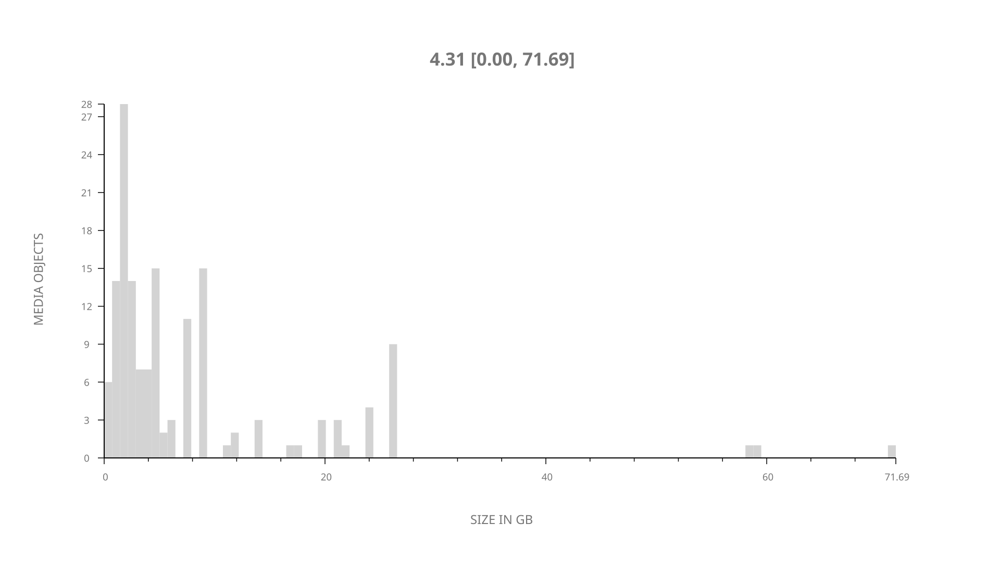
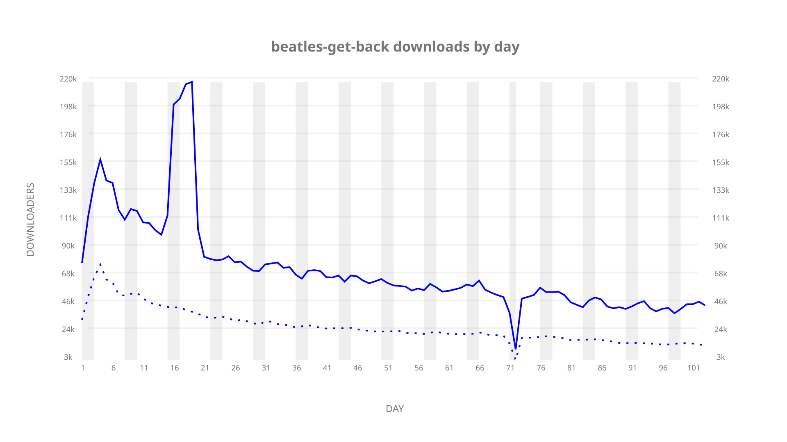
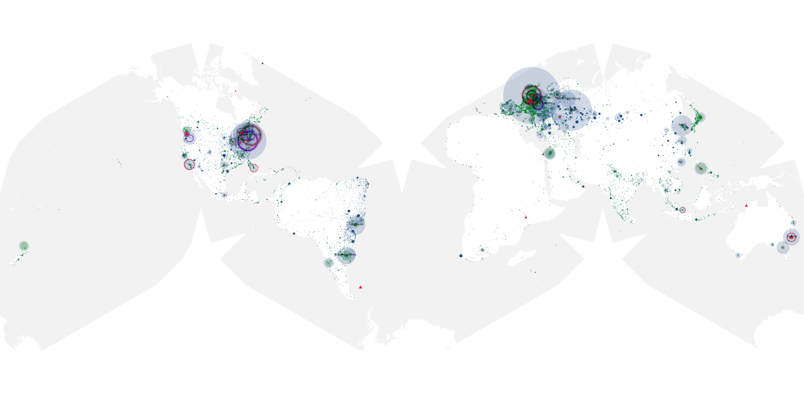
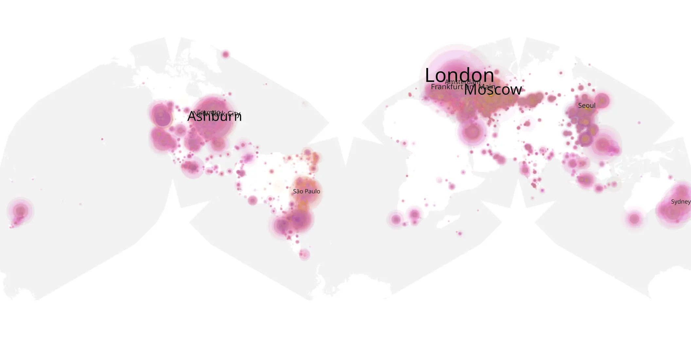
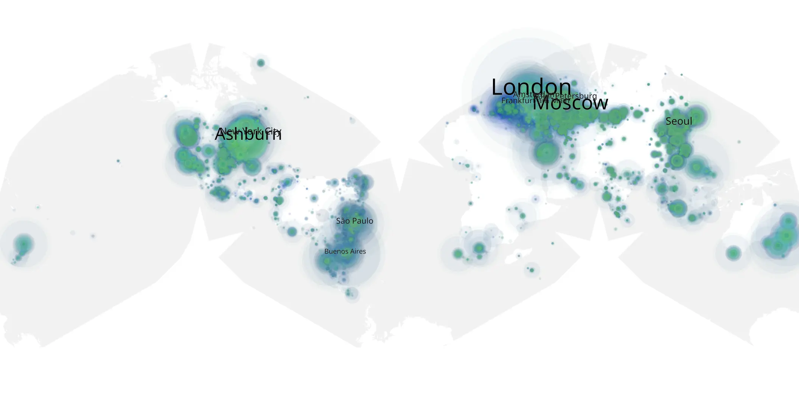

# beatles-get-back sample cache audit

## 1. Media object

| Field | Value |
| --- | --- |
| Media object | The Beatles: Get Back |
| Collection key | `beatles-get-back` |
| imdb_id | [tt9735318](https://www.imdb.com/title/tt9735318/) |
| wikipedia_url | [The Beatles: Get Back](https://en.wikipedia.org/wiki/The_Beatles:_Get_Back) |
| Sample dates | 2021-11-26-to-2022-03-10 |
| Sample days | 105 |
| BTIH count | 197 |
| Unique BTIH count | 153 |
| Downloaders total | 5,259,949 |
| Uploaders total | 1,600,346 |
| Data version | `2026-08-05` |
| IP geolocation version | `6:1777968300` |

## 2. Coverage report

- Generated: 2026-09-03T11:11:21Z
- Evidence: read-only Day-member stream of the selected cache archive; no raw sample contents were opened
- Required sample span: 2021-11-26 to 2022-03-10 (105 days)
- Cache Day products: 103
- Sparse Day indices: 2
- Post-release Day products: 0

### Sample archive discontinuities

- missing Day index 72: `2022-02-05`
- missing Day index 74: `2022-02-07`

## 3. File sizes histogram *median[lowest, highest]*

## 4. Graphs

### Downloads by week cumulative (normalized start)



### Downloads by day, Saturday and Sunday in gray

## 5. Cumulative Maps

<!-- https://raw.githubusercontent.com/alpha60-devops/alpha60-results-2021/refs/heads/main/data/ -->

### <a href="https://raw.githubusercontent.com/alpha60-devops/alpha60-results-2021/refs/heads/main/data/geojson.cumulative/beatles-get-back-cumulative-aggregate.geojson.gz" data-map-title="The Beatles: Get Back — beatles-get-back" onclick="leaflet_map_open_window(this.href, this.dataset.mapTitle); return false;" class="table-link" aria-label="Open The Beatles: Get Back (beatles-get-back) cumulative data map in new window" title="Opens interactive map for The Beatles: Get Back (beatles-get-back) data">Swarm Detail</a>

### Geographic Regions

| Africa | Americas | Asia | Europe | Oceania | Unknown |
| --- | --- | --- | --- | --- | --- |
| 1.17 | 30.52 | 14.87 | 40.70 | 3.20 | 2.22 |

### Network infrastructure

{:target="_blank" rel="noopener"}

### Resolution >= 1080p

{:target="_blank" rel="noopener"}

### Resolution < 1080p

{:target="_blank" rel="noopener"}
