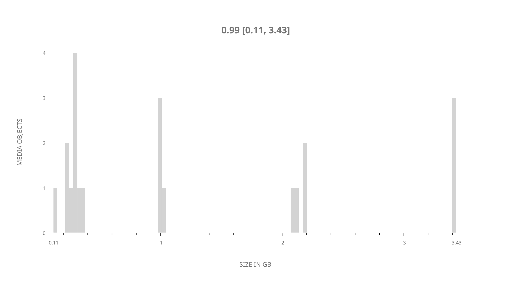
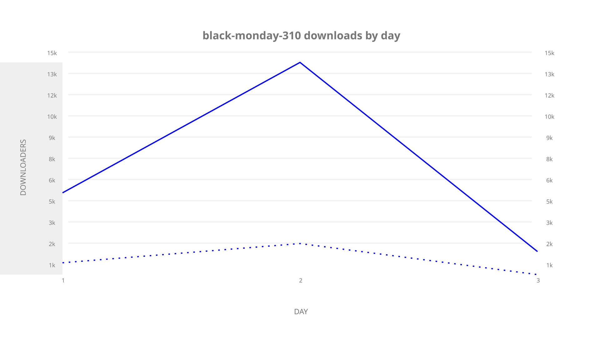
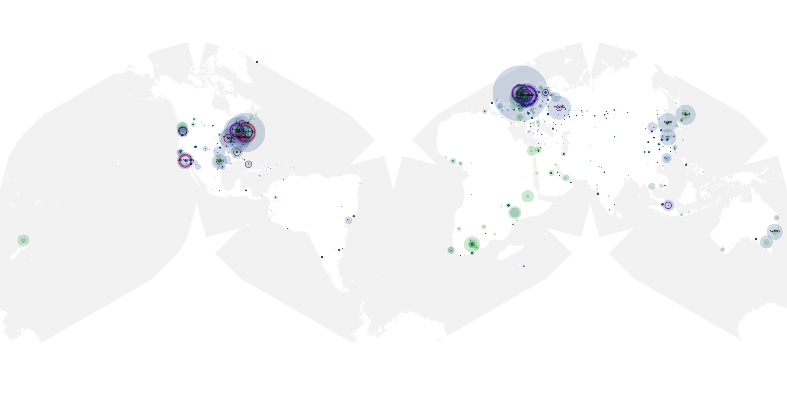
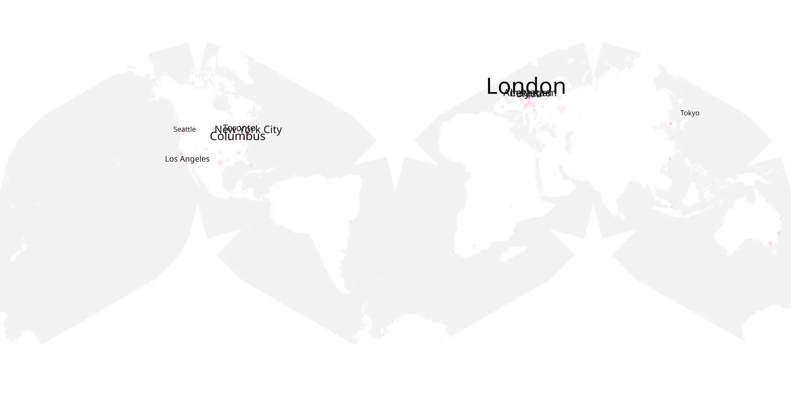
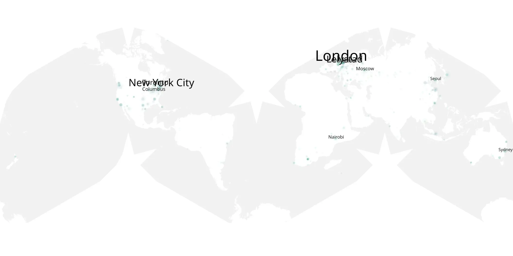

# black-monday-310 sample cache audit

## 1. Media object

| Field | Value |
| --- | --- |
| Media object | Black Monday |
| Collection key | `black-monday-310` |
| imdb_id | [tt7406334](https://www.imdb.com/title/tt7406334/) |
| wikipedia_url | [Black Monday (TV series)](https://en.wikipedia.org/wiki/Black_Monday_(TV_series)) |
| Sample dates | 2021-08-01-to-2021-08-03 |
| Sample days | 3 |
| BTIH count | 21 |
| Unique BTIH count | 21 |
| Downloaders total | 19,481 |
| Uploaders total | 3,370 |
| Data version | `2026-08-05` |
| IP geolocation version | `6:1777968300` |

## 2. Sample coverage report

- Generated: 2026-09-10T15:44:03Z
- Sample archive directory: `/mnt/gold/src/alpha60-samples-raw.gold/black-monday-310.xz`
- Hour directories: 31
- Zero-length sample files: 0
- Other unparsable sample files: 0
- Hourly discontinuities: 0 (0 missing hours)
- Missing days: 0

### Sample archive discontinuities

None detected.

## 3. Media objects file size histogram

## 4. Visualization pass — graphs

### Downloads by week cumulative (normalized start)



### Downloads by day, Saturday and Sunday in gray

## 5. Visualization pass — maps

### Cumulative geographic slices

| Africa | Americas | Asia | Europe | Oceania | Unknown |
| --- | --- | --- | --- | --- | --- |
| 3.77 | 27.72 | 10.66 | 25.45 | 2.54 | 4.32 |

### Cumulative network infrastructure

{:target="_blank" rel="noopener"}

### Cumulative data maps

**Cumulative >= 1080p**

{:target="_blank" rel="noopener"}

**Cumulative < 1080p**

{:target="_blank" rel="noopener"}
