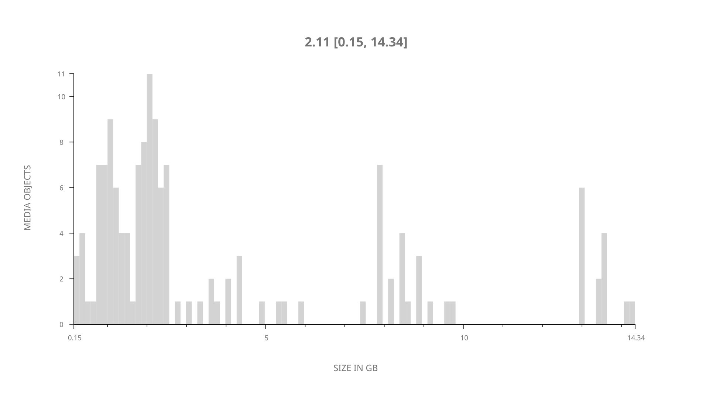
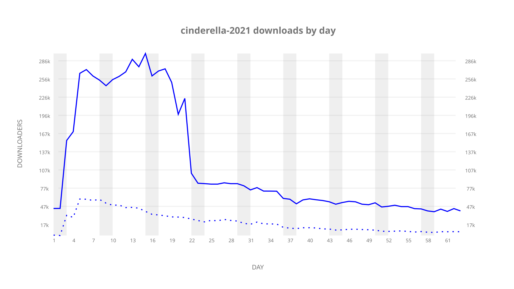
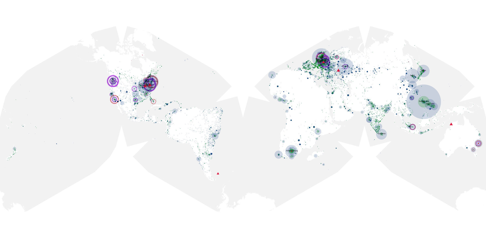
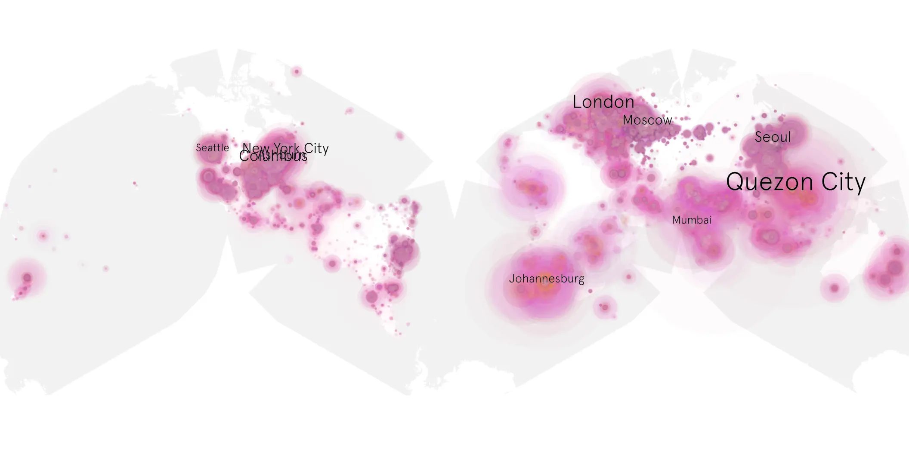
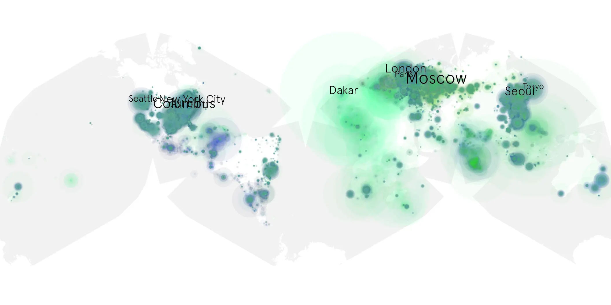

# cinderella-2021 sample cache audit

## 1. Media object

| Field | Value |
| --- | --- |
| Media object | Cinderella |
| Collection key | `cinderella-2021` |
| imdb_id | [tt10155932](https://www.imdb.com/title/tt10155932/) |
| wikipedia_url | [Cinderella (2021 American film)](https://en.wikipedia.org/wiki/Cinderella_(2021_American_film)) |
| Sample dates | 2021-09-03-to-2021-11-11 |
| Sample days | 70 |
| BTIH count | 154 |
| Unique BTIH count | 145 |
| Downloaders total | 5,439,104 |
| Uploaders total | 1,257,296 |
| Data version | `2026-08-05` |
| IP geolocation version | `6:1777968300` |

## 2. Sample coverage report

- Generated: 2026-09-03T11:11:21Z
- Evidence: read-only Day-member stream of the selected cache archive; no raw sample contents were opened
- Required sample span: 2021-09-03 to 2021-11-11 (70 days)
- Cache Day products: 63
- Sparse Day indices: 7
- Post-release Day products: 0

### Sample archive discontinuities

- missing Day index 36: `2021-10-08`
- missing Day index 37: `2021-10-09`
- missing Day index 38: `2021-10-10`
- missing Day index 39: `2021-10-11`
- missing Day index 40: `2021-10-12`
- missing Day index 41: `2021-10-13`
- missing Day index 42: `2021-10-14`

## 3. Media objects file size histogram

## 4. Visualization pass — graphs

### Downloads by week cumulative (normalized start)



### Downloads by day, Saturday and Sunday in gray

## 5. Visualization pass — maps

### Cumulative geographic slices

| Africa | Americas | Asia | Europe | Oceania | Unknown |
| --- | --- | --- | --- | --- | --- |
| 10.39 | 25.06 | 24.22 | 24.33 | 1.86 | 5.24 |

### Cumulative network infrastructure

{:target="_blank" rel="noopener"}

### Cumulative data maps

**Cumulative >= 1080p**

{:target="_blank" rel="noopener"}

**Cumulative < 1080p**

{:target="_blank" rel="noopener"}
