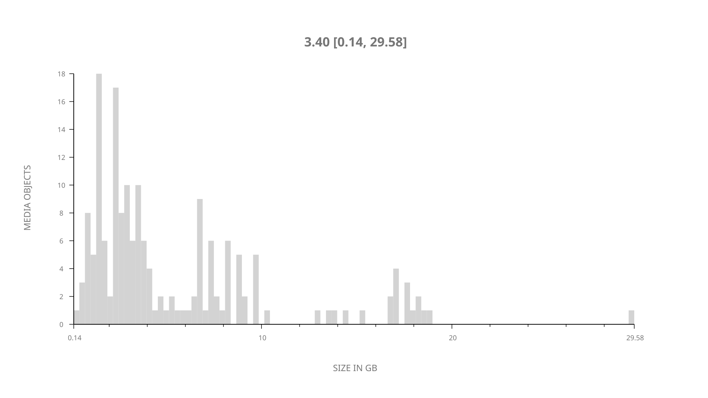
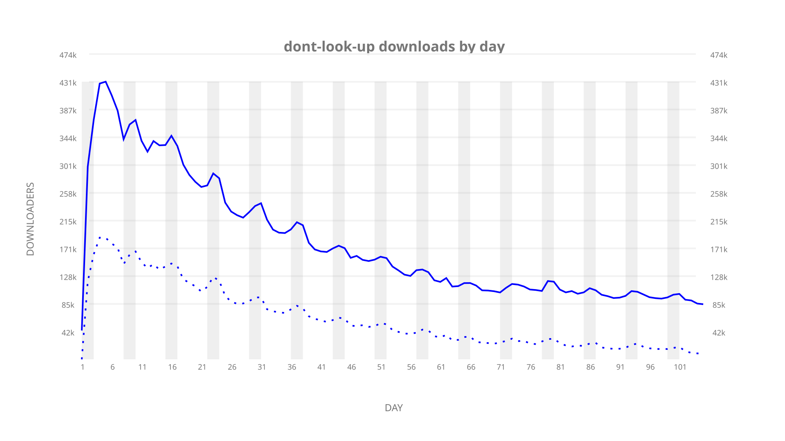
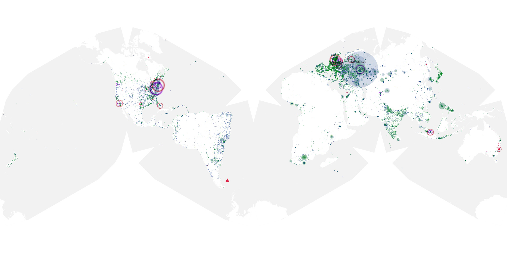
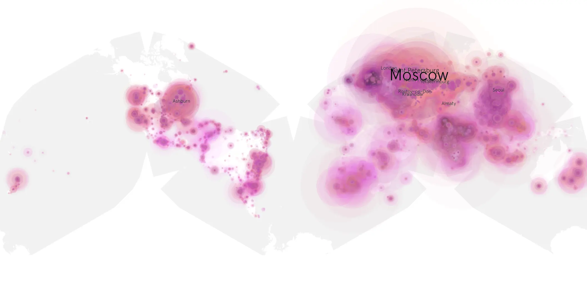
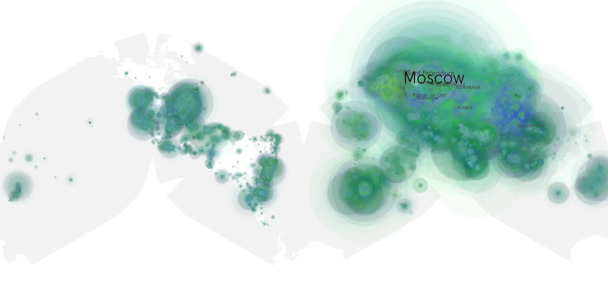

# dont-look-up sample cache audit

## 1. Media object

| Field | Value |
| --- | --- |
| Media object | Don't Look Up |
| Collection key | `dont-look-up` |
| imdb_id | [tt11286314](https://www.imdb.com/title/tt11286314/) |
| wikipedia_url | [Don't Look Up](https://en.wikipedia.org/wiki/Don%27t_Look_Up) |
| Sample dates | 2021-12-24-to-2022-04-07 |
| Sample days | 105 |
| BTIH count | 205 |
| Unique BTIH count | 173 |
| Downloaders total | 15,407,604 |
| Uploaders total | 6,786,268 |
| Data version | `2026-08-05` |
| IP geolocation version | `6:1777968300` |

## 2. Sample coverage report

- Generated: 2026-09-03T11:11:21Z
- Evidence: read-only Day-member stream of the selected cache archive; no raw sample contents were opened
- Required sample span: 2021-12-24 to 2022-04-07 (105 days)
- Cache Day products: 105
- Sparse Day indices: 0
- Post-release Day products: 0

### Sample archive discontinuities

None detected.

## 3. Media objects file size histogram

## 4. Visualization pass — graphs

### Downloads by week cumulative (normalized start)



### Downloads by day, Saturday and Sunday in gray

## 5. Visualization pass — maps

### Cumulative geographic slices

| Africa | Americas | Asia | Europe | Oceania | Unknown |
| --- | --- | --- | --- | --- | --- |
| 6.62 | 9.49 | 22.43 | 54.43 | 1.20 | 0.67 |

### Cumulative network infrastructure

{:target="_blank" rel="noopener"}

### Cumulative data maps

**Cumulative >= 1080p**

{:target="_blank" rel="noopener"}

**Cumulative < 1080p**

{:target="_blank" rel="noopener"}
