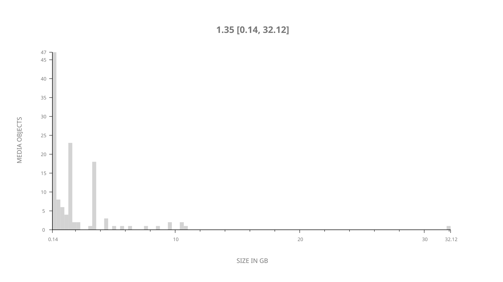
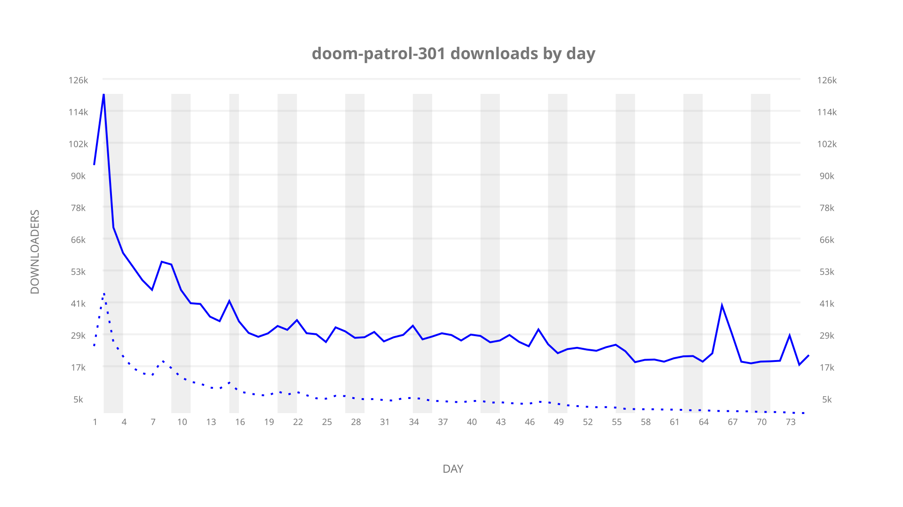
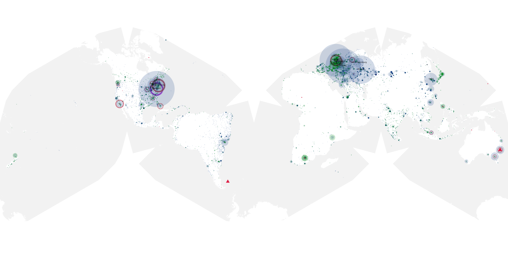
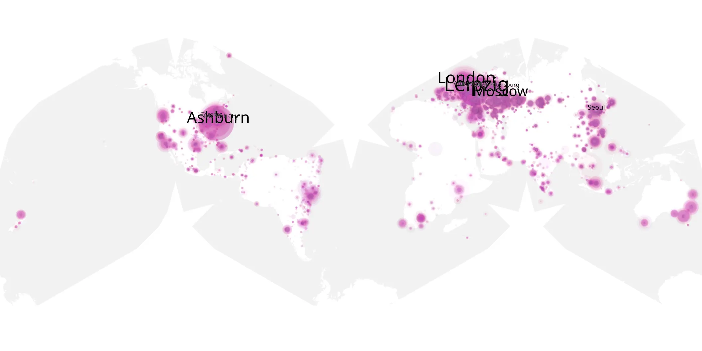
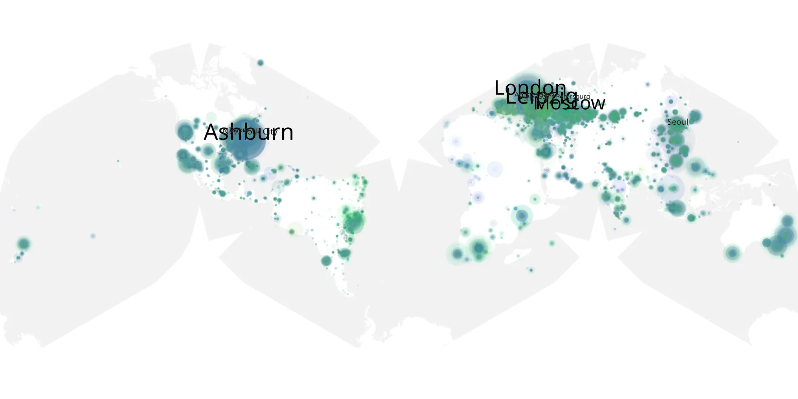

# doom-patrol-301 sample cache audit

## 1. Media object

| Field | Value |
| --- | --- |
| Media object | Doom Patrol |
| Collection key | `doom-patrol-301` |
| imdb_id | [tt8416494](https://www.imdb.com/title/tt8416494/) |
| wikipedia_url | [Doom Patrol (TV series)](https://en.wikipedia.org/wiki/Doom_Patrol_(TV_series)) |
| Sample dates | 2021-09-23-to-2021-12-09 |
| Sample days | 78 |
| BTIH count | 139 |
| Unique BTIH count | 125 |
| Downloaders total | 1,911,222 |
| Uploaders total | 451,110 |
| Data version | `2026-08-05` |
| IP geolocation version | `6:1777968300` |

## 2. Coverage report

- Generated: 2026-09-03T11:11:21Z
- Evidence: read-only Day-member stream of the selected cache archive; no raw sample contents were opened
- Required sample span: 2021-09-23 to 2021-12-09 (78 days)
- Cache Day products: 75
- Sparse Day indices: 3
- Post-release Day products: 0

### Sample archive discontinuities

- missing Day index 16: `2021-10-08`
- missing Day index 17: `2021-10-09`
- missing Day index 23: `2021-10-15`

## 3. File sizes histogram *median[lowest, highest]*

## 4. Graphs

### Downloads by week cumulative (normalized start)



### Downloads by day, Saturday and Sunday in gray

## 5. Cumulative Maps

<!-- https://raw.githubusercontent.com/alpha60-devops/alpha60-results-2021/refs/heads/main/data/ -->

### <a href="https://raw.githubusercontent.com/alpha60-devops/alpha60-results-2021/refs/heads/main/data/geojson.cumulative/doom-patrol-301-cumulative-aggregate.geojson.gz" data-map-title="Doom Patrol — doom-patrol-301" onclick="leaflet_map_open_window(this.href, this.dataset.mapTitle); return false;" class="table-link" aria-label="Open Doom Patrol (doom-patrol-301) cumulative data map in new window" title="Opens interactive map for Doom Patrol (doom-patrol-301) data">Swarm Detail</a>

### Geographic Regions

| Africa | Americas | Asia | Europe | Oceania | Unknown |
| --- | --- | --- | --- | --- | --- |
| 3.14 | 25.70 | 16.13 | 47.02 | 3.18 | 1.30 |

### Network infrastructure

{:target="_blank" rel="noopener"}

### Resolution >= 1080p

{:target="_blank" rel="noopener"}

### Resolution < 1080p

{:target="_blank" rel="noopener"}
