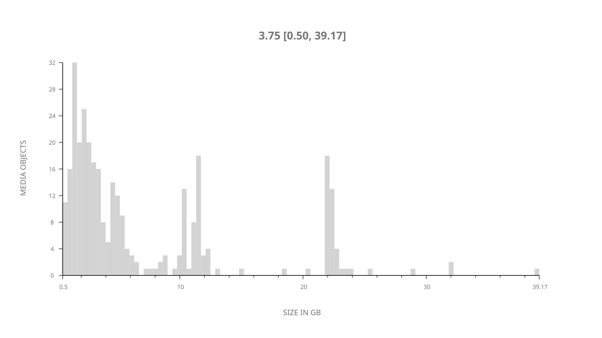
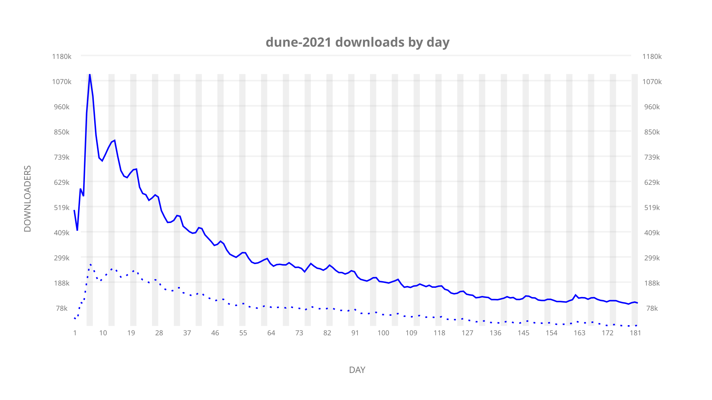
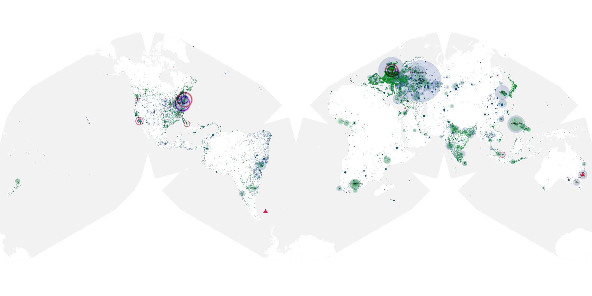
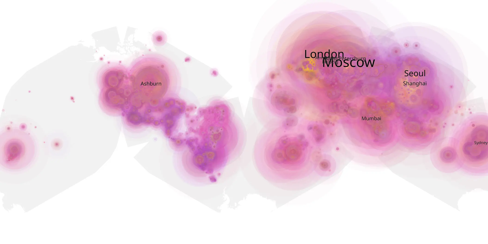
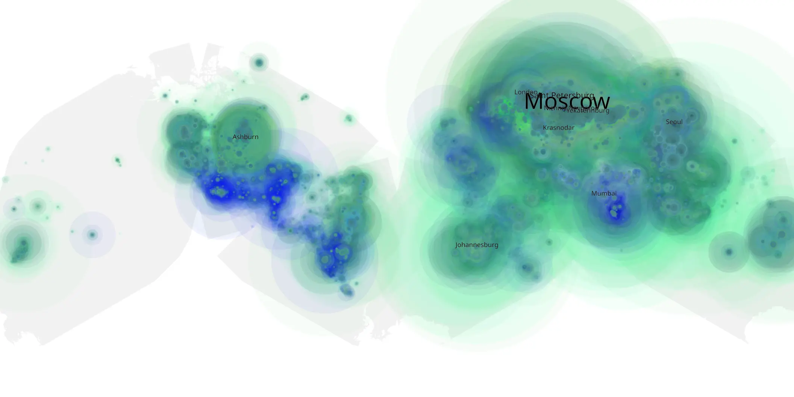

# dune-2021 sample cache audit

## 1. Media object

| Field | Value |
| --- | --- |
| Media object | Dune 2021: Part One |
| Collection key | `dune-2021` |
| imdb_id | [tt1160419](https://www.imdb.com/title/tt1160419/) |
| wikipedia_url | [Dune (2021 film)](https://en.wikipedia.org/wiki/Dune_(2021_film)) |
| Sample dates | 2021-10-18-to-2022-04-17 |
| Sample days | 182 |
| BTIH count | 368 |
| Unique BTIH count | 320 |
| Downloaders total | 37,177,029 |
| Uploaders total | 13,541,903 |
| Data version | `2026-08-05` |
| IP geolocation version | `6:1777968300` |

## 2. Coverage report

- Generated: 2026-09-03T11:11:21Z
- Evidence: read-only Day-member stream of the selected cache archive; no raw sample contents were opened
- Required sample span: 2021-10-18 to 2022-04-17 (182 days)
- Cache Day products: 182
- Sparse Day indices: 0
- Post-release Day products: 0

### Sample archive discontinuities

None detected.

## 3. File sizes histogram *median[lowest, highest]*

## 4. Graphs

### Downloads by week cumulative (normalized start)



### Downloads by day, Saturday and Sunday in gray

## 5. Cumulative Maps

<!-- https://raw.githubusercontent.com/alpha60-devops/alpha60-results-2021/refs/heads/main/data/ -->

### <a href="https://raw.githubusercontent.com/alpha60-devops/alpha60-results-2021/refs/heads/main/data/geojson.cumulative/dune-2021-cumulative-aggregate.geojson.gz" data-map-title="Dune 2021: Part One — dune-2021" onclick="leaflet_map_open_window(this.href, this.dataset.mapTitle); return false;" class="table-link" aria-label="Open Dune 2021: Part One (dune-2021) cumulative data map in new window" title="Opens interactive map for Dune 2021: Part One (dune-2021) data">Swarm Detail</a>

### Geographic Regions

| Africa | Americas | Asia | Europe | Oceania | Unknown |
| --- | --- | --- | --- | --- | --- |
| 6.46 | 14.87 | 25.12 | 42.41 | 2.16 | 0.68 |

### Network infrastructure

{:target="_blank" rel="noopener"}

### Resolution >= 1080p

{:target="_blank" rel="noopener"}

### Resolution < 1080p

{:target="_blank" rel="noopener"}
