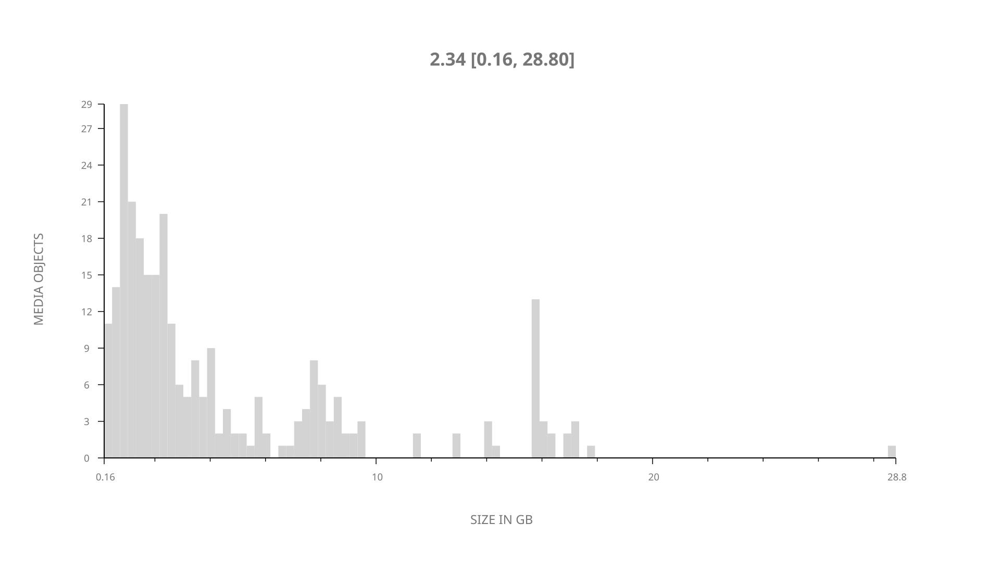
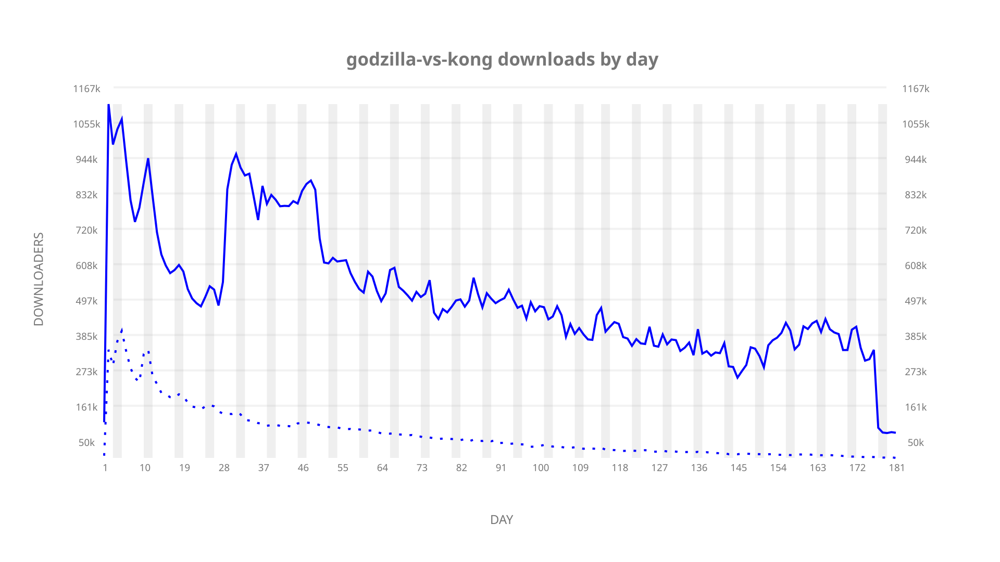
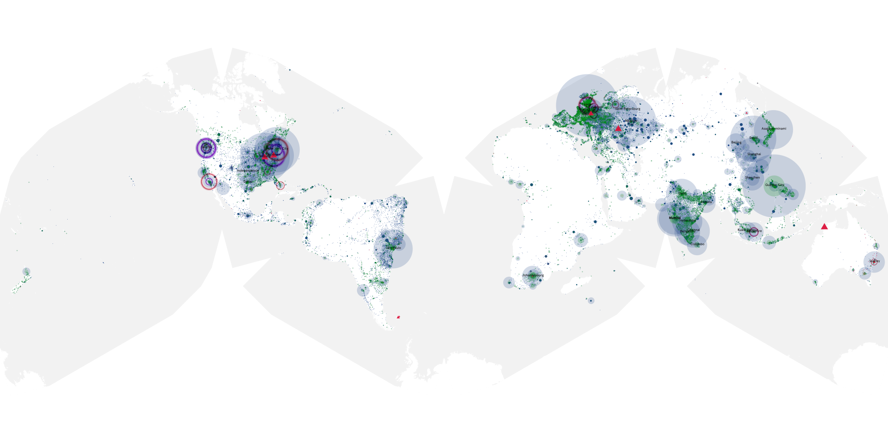
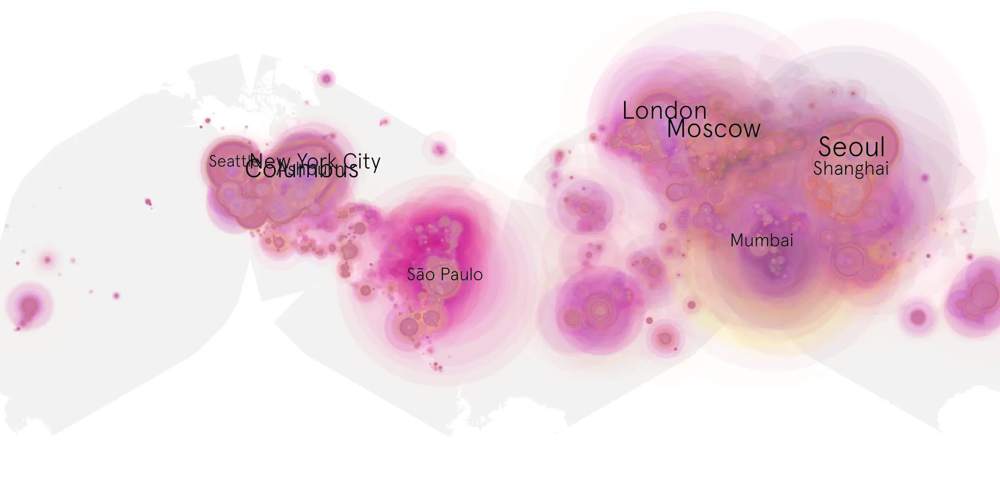
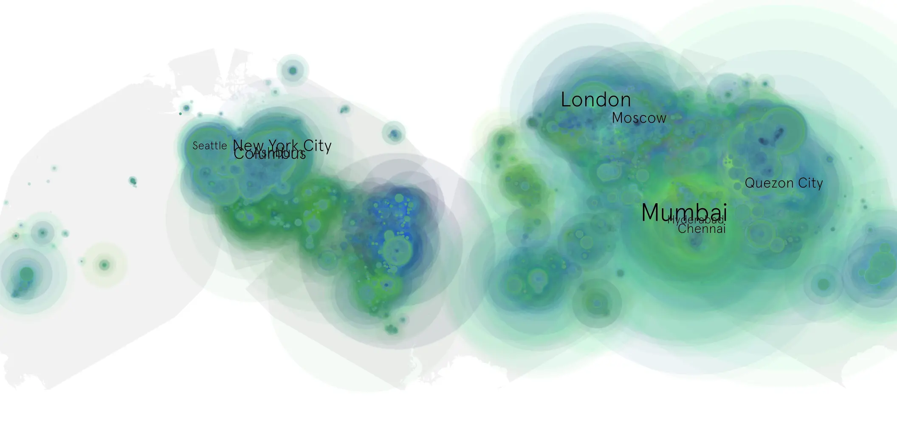

# godzilla-vs-kong sample cache audit

## 1. Media object

| Field | Value |
| --- | --- |
| Media object | Godzilla vs. Kong |
| Collection key | `godzilla-vs-kong` |
| imdb_id | [tt5034838](https://www.imdb.com/title/tt5034838/) |
| wikipedia_url | [Godzilla vs. Kong](https://en.wikipedia.org/wiki/Godzilla_vs._Kong) |
| Sample dates | 2021-03-31-to-2021-09-28 |
| Sample days | 182 |
| BTIH count | 307 |
| Unique BTIH count | 276 |
| Downloaders total | 48,466,070 |
| Uploaders total | 11,479,839 |
| Data version | `2026-08-05` |
| IP geolocation version | `6:1777968300` |

## 2. Sample coverage report

- Generated: 2026-09-03T11:11:21Z
- Evidence: read-only Day-member stream of the selected cache archive; no raw sample contents were opened
- Required sample span: 2021-03-31 to 2021-09-28 (182 days)
- Cache Day products: 181
- Sparse Day indices: 1
- Post-release Day products: 0

### Sample archive discontinuities

- missing Day index 113: `2021-07-21`

## 3. Media objects file size histogram

## 4. Visualization pass — graphs

### Downloads by week cumulative (normalized start)



### Downloads by day, Saturday and Sunday in gray

## 5. Visualization pass — maps

### Cumulative geographic slices

| Africa | Americas | Asia | Europe | Oceania | Unknown |
| --- | --- | --- | --- | --- | --- |
| 4.38 | 29.17 | 30.31 | 24.49 | 1.52 | 5.65 |

### Cumulative network infrastructure

{:target="_blank" rel="noopener"}

### Cumulative data maps

**Cumulative >= 1080p**

{:target="_blank" rel="noopener"}

**Cumulative < 1080p**

{:target="_blank" rel="noopener"}
