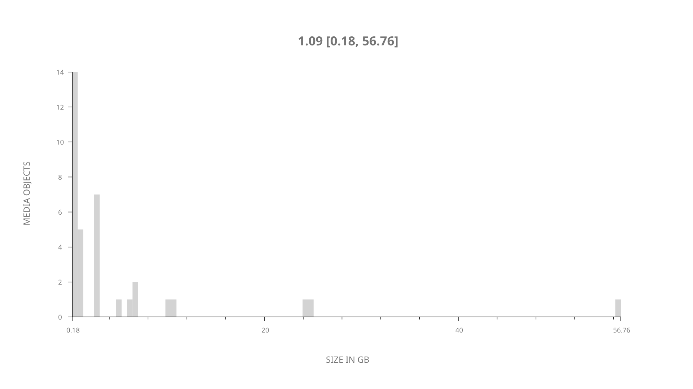
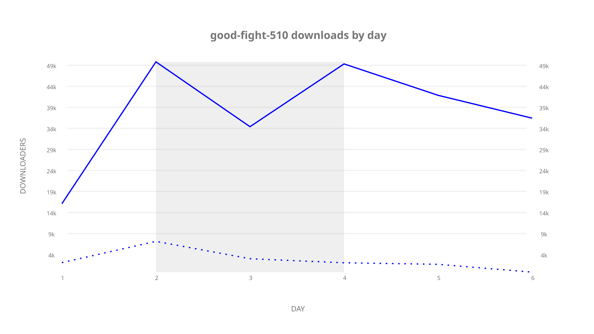
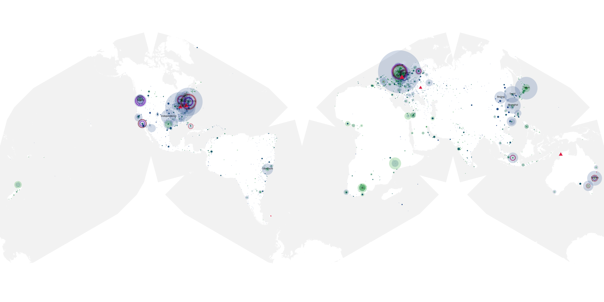
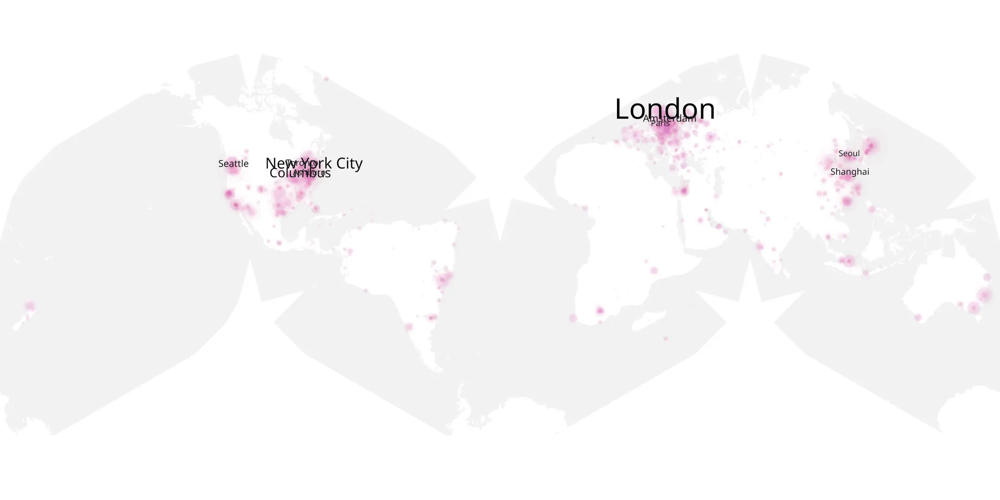
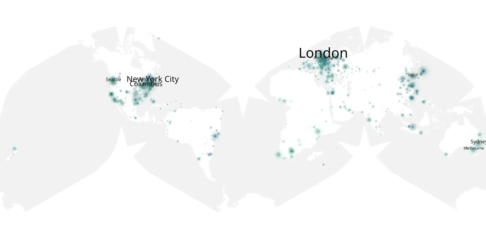

# good-fight-510 sample cache audit

## 1. Media object

| Field | Value |
| --- | --- |
| Media object | The Good Fight |
| Collection key | `good-fight-510` |
| imdb_id | [tt6338482](https://www.imdb.com/title/tt6338482/) |
| wikipedia_url | [The Good Fight](https://en.wikipedia.org/wiki/The_Good_Fight) |
| Sample dates | 2021-08-26-to-2021-08-31 |
| Sample days | 6 |
| BTIH count | 41 |
| Unique BTIH count | 35 |
| Downloaders total | 223,310 |
| Uploaders total | 30,425 |
| Data version | `2026-08-05` |
| IP geolocation version | `6:1777968300` |

## 2. Coverage report

- Generated: 2026-09-10T15:44:03Z
- Sample archive directory: `/mnt/gold/src/alpha60-samples-raw.gold/good-fight-510.xz`
- Hour directories: 126
- Zero-length sample files: 0
- Other unparsable sample files: 0
- Hourly discontinuities: 0 (0 missing hours)
- Missing days: 0

### Sample archive discontinuities

None detected.

## 3. File sizes histogram *median[lowest, highest]*

## 4. Graphs

### Downloads by week cumulative (normalized start)



### Downloads by day, Saturday and Sunday in gray

## 5. Cumulative Maps

<!-- https://raw.githubusercontent.com/alpha60-devops/alpha60-results-2021/refs/heads/main/data/ -->

### <a href="https://raw.githubusercontent.com/alpha60-devops/alpha60-results-2021/refs/heads/main/data/geojson.cumulative/good-fight-510-cumulative-aggregate.geojson.gz" data-map-title="The Good Fight — good-fight-510" onclick="leaflet_map_open_window(this.href, this.dataset.mapTitle); return false;" class="table-link" aria-label="Open The Good Fight (good-fight-510) cumulative data map in new window" title="Opens interactive map for The Good Fight (good-fight-510) data">Swarm Detail</a>

### Geographic Regions

| Africa | Americas | Asia | Europe | Oceania | Unknown |
| --- | --- | --- | --- | --- | --- |
| 3.72 | 29.88 | 15.67 | 24.47 | 2.86 | 7.49 |

### Network infrastructure

{:target="_blank" rel="noopener"}

### Resolution >= 1080p

{:target="_blank" rel="noopener"}

### Resolution < 1080p

{:target="_blank" rel="noopener"}
