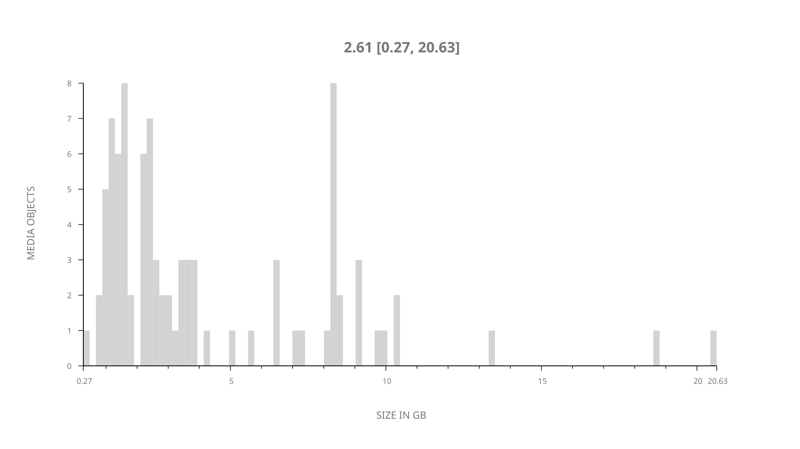
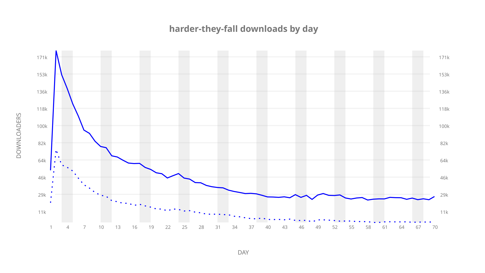
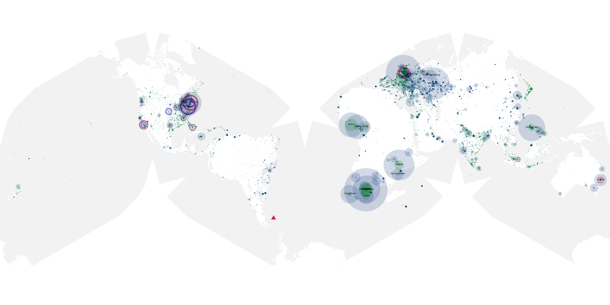
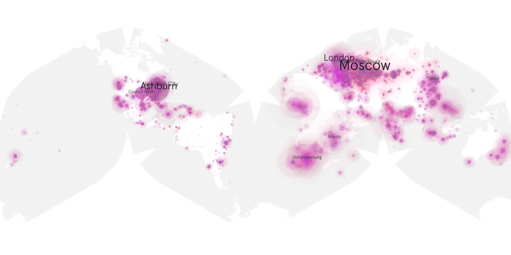
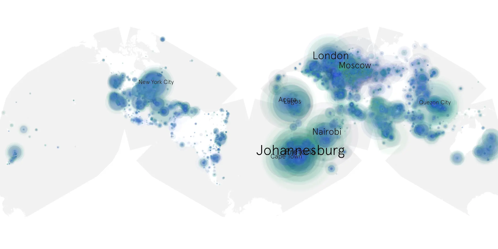

# harder-they-fall sample cache audit

## 1. Media object

| Field | Value |
| --- | --- |
| Media object | The Harder They Fall |
| Collection key | `harder-they-fall` |
| imdb_id | [tt10696784](https://www.imdb.com/title/tt10696784/) |
| wikipedia_url | [The Harder They Fall (2021 film)](https://en.wikipedia.org/wiki/The_Harder_They_Fall_(2021_film)) |
| Sample dates | 2021-11-03-to-2022-01-11 |
| Sample days | 70 |
| BTIH count | 120 |
| Unique BTIH count | 90 |
| Downloaders total | 3,484,476 |
| Uploaders total | 1,241,669 |
| Data version | `2026-08-05` |
| IP geolocation version | `6:1777968300` |

## 2. Coverage report

- Generated: 2026-09-03T11:11:21Z
- Evidence: read-only Day-member stream of the selected cache archive; no raw sample contents were opened
- Required sample span: 2021-11-03 to 2022-01-11 (70 days)
- Cache Day products: 70
- Sparse Day indices: 0
- Post-release Day products: 0

### Sample archive discontinuities

None detected.

## 3. File sizes histogram *median[lowest, highest]*

## 4. Graphs

### Downloads by week cumulative (normalized start)



### Downloads by day, Saturday and Sunday in gray

## 5. Cumulative Maps

<!-- https://raw.githubusercontent.com/alpha60-devops/alpha60-results-2021/refs/heads/main/data/ -->

### <a href="https://raw.githubusercontent.com/alpha60-devops/alpha60-results-2021/refs/heads/main/data/geojson.cumulative/harder-they-fall-cumulative-aggregate.geojson.gz" data-map-title="The Harder They Fall — harder-they-fall" onclick="leaflet_map_open_window(this.href, this.dataset.mapTitle); return false;" class="table-link" aria-label="Open The Harder They Fall (harder-they-fall) cumulative data map in new window" title="Opens interactive map for The Harder They Fall (harder-they-fall) data">Swarm Detail</a>

### Geographic Regions

| Africa | Americas | Asia | Europe | Oceania | Unknown |
| --- | --- | --- | --- | --- | --- |
| 19.11 | 17.15 | 20.87 | 32.06 | 2.54 | 0.66 |

### Network infrastructure

{:target="_blank" rel="noopener"}

### Resolution >= 1080p

{:target="_blank" rel="noopener"}

### Resolution < 1080p

{:target="_blank" rel="noopener"}
