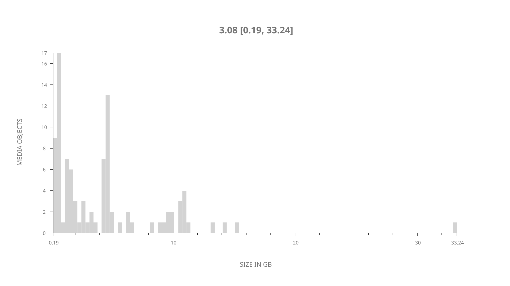
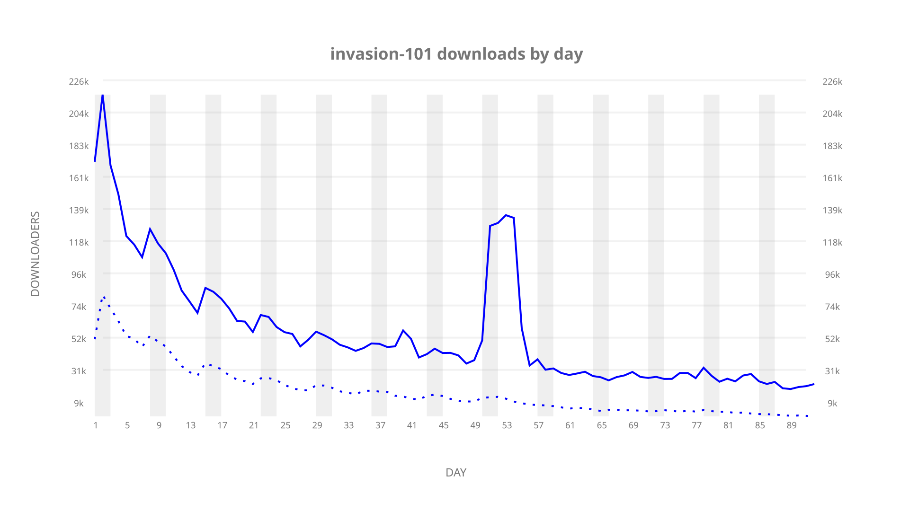
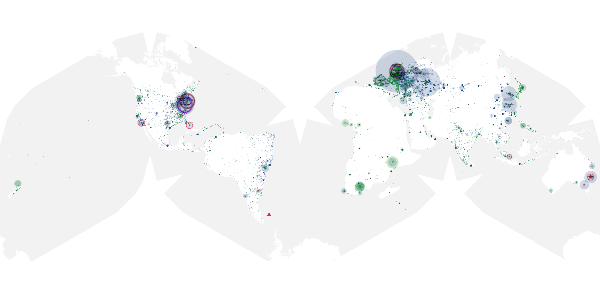
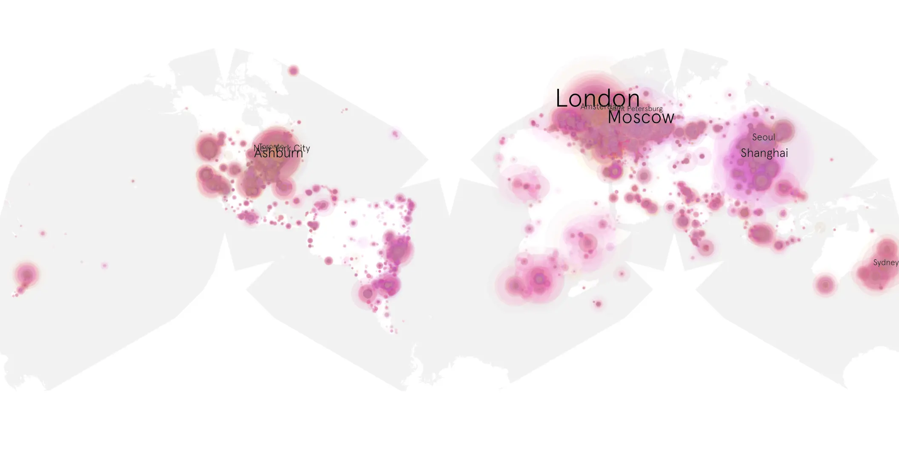
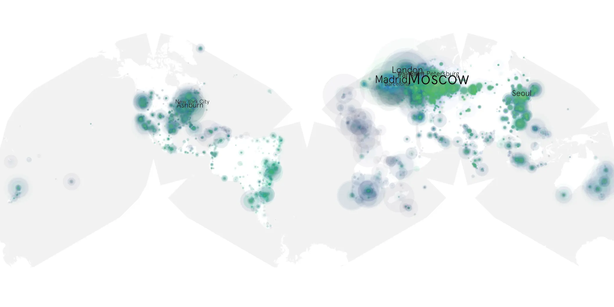

# invasion-101 sample cache audit

## 1. Media object

| Field | Value |
| --- | --- |
| Media object | Invasion |
| Collection key | `invasion-101` |
| imdb_id | [tt9737326](https://www.imdb.com/title/tt9737326/) |
| wikipedia_url | [Invasion (2021 TV series)](https://en.wikipedia.org/wiki/Invasion_(2021_TV_series)) |
| Sample dates | 2021-10-22-to-2022-01-21 |
| Sample days | 92 |
| BTIH count | 113 |
| Unique BTIH count | 96 |
| Downloaders total | 3,898,065 |
| Uploaders total | 1,208,075 |
| Data version | `2026-08-05` |
| IP geolocation version | `6:1777968300` |

## 2. Coverage report

- Generated: 2026-09-03T11:11:21Z
- Evidence: read-only Day-member stream of the selected cache archive; no raw sample contents were opened
- Required sample span: 2021-10-22 to 2022-01-21 (92 days)
- Cache Day products: 92
- Sparse Day indices: 0
- Post-release Day products: 0

### Sample archive discontinuities

None detected.

## 3. File sizes histogram *median[lowest, highest]*

## 4. Graphs

### Downloads by week cumulative (normalized start)



### Downloads by day, Saturday and Sunday in gray

## 5. Cumulative Maps

<!-- https://raw.githubusercontent.com/alpha60-devops/alpha60-results-2021/refs/heads/main/data/ -->

### <a href="https://raw.githubusercontent.com/alpha60-devops/alpha60-results-2021/refs/heads/main/data/geojson.cumulative/invasion-101-cumulative-aggregate.geojson.gz" data-map-title="Invasion — invasion-101" onclick="leaflet_map_open_window(this.href, this.dataset.mapTitle); return false;" class="table-link" aria-label="Open Invasion (invasion-101) cumulative data map in new window" title="Opens interactive map for Invasion (invasion-101) data">Swarm Detail</a>

### Geographic Regions

| Africa | Americas | Asia | Europe | Oceania | Unknown |
| --- | --- | --- | --- | --- | --- |
| 5.80 | 22.44 | 18.62 | 43.02 | 3.45 | 2.33 |

### Network infrastructure

{:target="_blank" rel="noopener"}

### Resolution >= 1080p

{:target="_blank" rel="noopener"}

### Resolution < 1080p

{:target="_blank" rel="noopener"}
