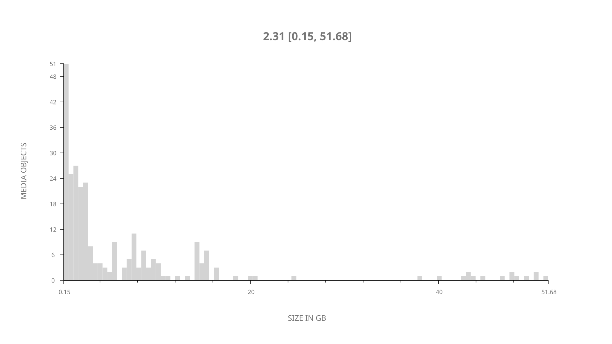
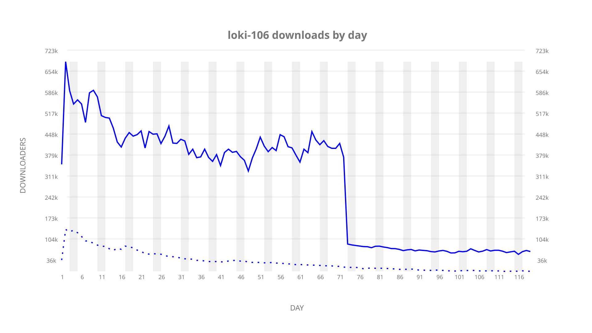
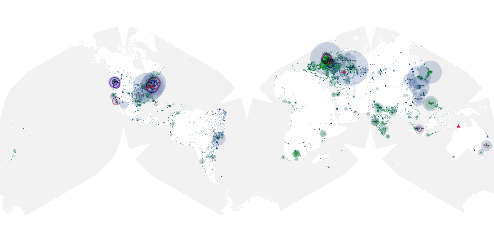
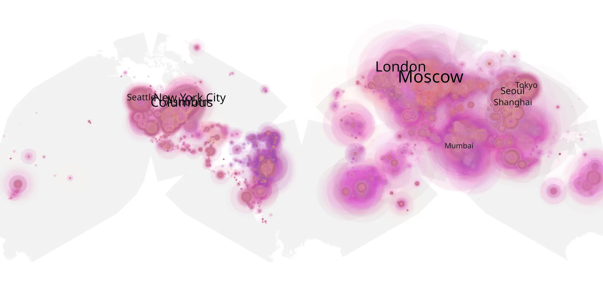
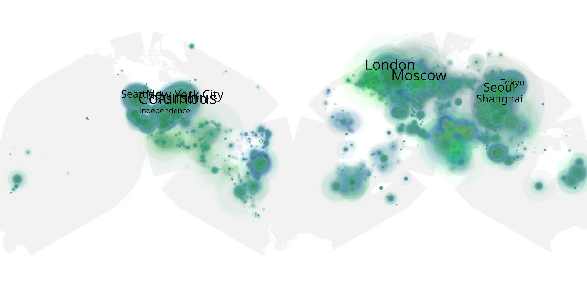

# loki-106 sample cache audit

## 1. Media object

| Field | Value |
| --- | --- |
| Media object | Loki |
| Collection key | `loki-106` |
| imdb_id | [tt9140554](https://www.imdb.com/title/tt9140554/) |
| wikipedia_url | [Loki (TV series)](https://en.wikipedia.org/wiki/Loki_(TV_series)) |
| Sample dates | 2021-07-14-to-2021-11-09 |
| Sample days | 119 |
| BTIH count | 287 |
| Unique BTIH count | 265 |
| Downloaders total | 21,440,310 |
| Uploaders total | 3,944,168 |
| Data version | `2026-08-05` |
| IP geolocation version | `6:1777968300` |

## 2. Coverage report

- Generated: 2026-09-03T11:11:21Z
- Evidence: read-only Day-member stream of the selected cache archive; no raw sample contents were opened
- Required sample span: 2021-07-14 to 2021-11-09 (119 days)
- Cache Day products: 119
- Sparse Day indices: 0
- Post-release Day products: 0

### Sample archive discontinuities

None detected.

## 3. File sizes histogram *median[lowest, highest]*

## 4. Graphs

### Downloads by week cumulative (normalized start)



### Downloads by day, Saturday and Sunday in gray

## 5. Cumulative Maps

<!-- https://raw.githubusercontent.com/alpha60-devops/alpha60-results-2021/refs/heads/main/data/ -->

### <a href="https://raw.githubusercontent.com/alpha60-devops/alpha60-results-2021/refs/heads/main/data/geojson.cumulative/loki-106-cumulative-aggregate.geojson.gz" data-map-title="Loki — loki-106" onclick="leaflet_map_open_window(this.href, this.dataset.mapTitle); return false;" class="table-link" aria-label="Open Loki (loki-106) cumulative data map in new window" title="Opens interactive map for Loki (loki-106) data">Swarm Detail</a>

### Geographic Regions

| Africa | Americas | Asia | Europe | Oceania | Unknown |
| --- | --- | --- | --- | --- | --- |
| 4.18 | 29.20 | 24.07 | 30.35 | 1.55 | 7.11 |

### Network infrastructure

{:target="_blank" rel="noopener"}

### Resolution >= 1080p

{:target="_blank" rel="noopener"}

### Resolution < 1080p

{:target="_blank" rel="noopener"}
