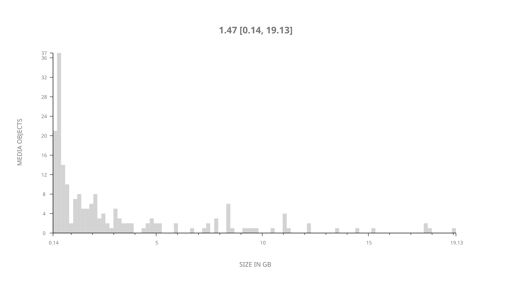
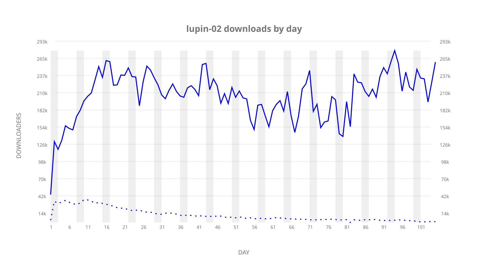
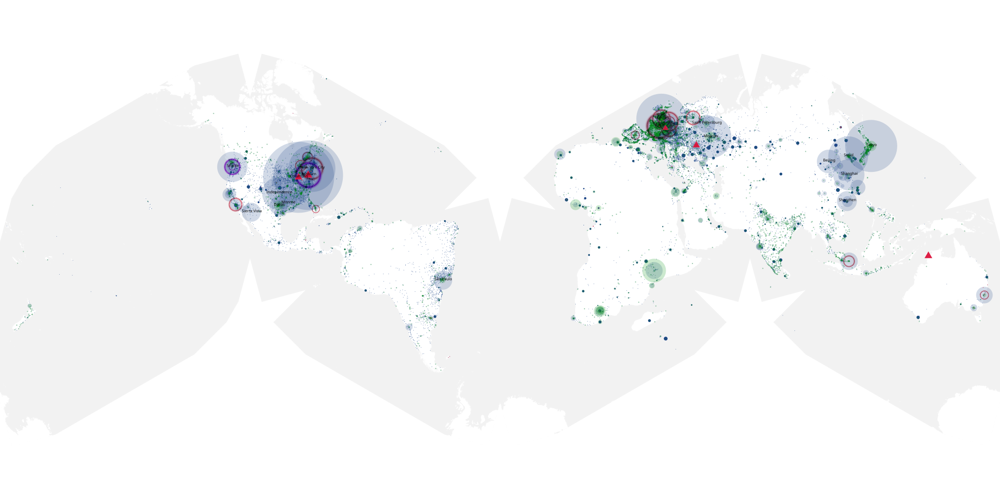
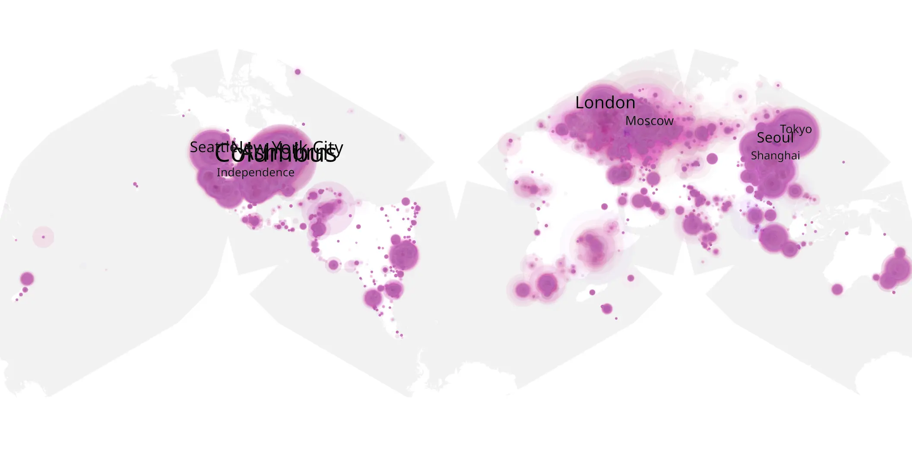
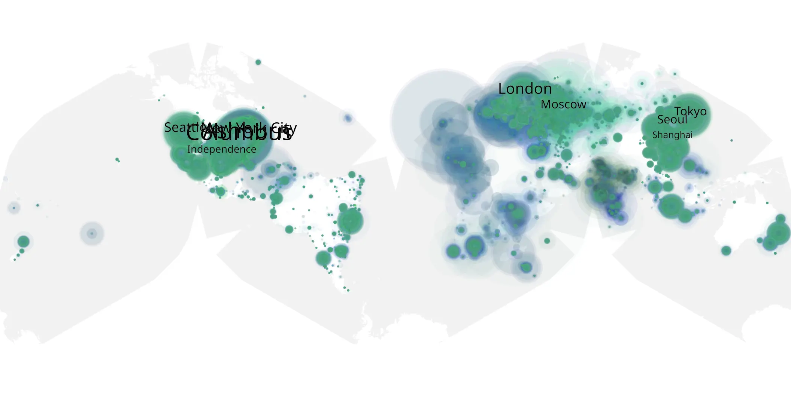

# lupin-02 sample cache audit

## 1. Media object

| Field | Value |
| --- | --- |
| Media object | Lupin |
| Collection key | `lupin-02` |
| imdb_id | [tt2531336](https://www.imdb.com/title/tt2531336/) |
| wikipedia_url | [Lupin (French TV series)](https://en.wikipedia.org/wiki/Lupin_(French_TV_series)) |
| Sample dates | 2021-06-11-to-2021-09-23 |
| Sample days | 105 |
| BTIH count | 205 |
| Unique BTIH count | 192 |
| Downloaders total | 12,051,517 |
| Uploaders total | 1,423,078 |
| Data version | `2026-08-05` |
| IP geolocation version | `6:1777968300` |

## 2. Coverage report

- Generated: 2026-09-03T11:11:21Z
- Evidence: read-only Day-member stream of the selected cache archive; no raw sample contents were opened
- Required sample span: 2021-06-11 to 2021-09-23 (105 days)
- Cache Day products: 105
- Sparse Day indices: 0
- Post-release Day products: 0

### Sample archive discontinuities

None detected.

## 3. File sizes histogram *median[lowest, highest]*

## 4. Graphs

### Downloads by week cumulative (normalized start)



### Downloads by day, Saturday and Sunday in gray

## 5. Cumulative Maps

<!-- https://raw.githubusercontent.com/alpha60-devops/alpha60-results-2021/refs/heads/main/data/ -->

### <a href="https://raw.githubusercontent.com/alpha60-devops/alpha60-results-2021/refs/heads/main/data/geojson.cumulative/lupin-02-cumulative-aggregate.geojson.gz" data-map-title="Lupin — lupin-02" onclick="leaflet_map_open_window(this.href, this.dataset.mapTitle); return false;" class="table-link" aria-label="Open Lupin (lupin-02) cumulative data map in new window" title="Opens interactive map for Lupin (lupin-02) data">Swarm Detail</a>

### Geographic Regions

| Africa | Americas | Asia | Europe | Oceania | Unknown |
| --- | --- | --- | --- | --- | --- |
| 5.68 | 34.75 | 18.25 | 27.50 | 1.25 | 10.19 |

### Network infrastructure

{:target="_blank" rel="noopener"}

### Resolution >= 1080p

{:target="_blank" rel="noopener"}

### Resolution < 1080p

{:target="_blank" rel="noopener"}
