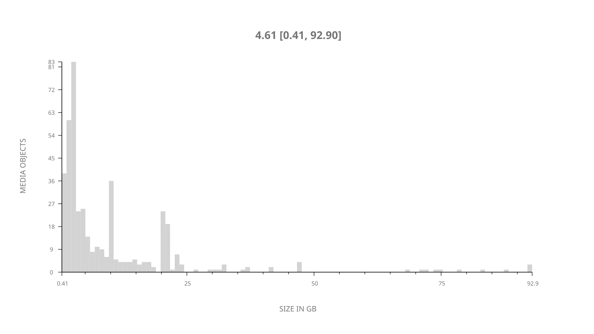
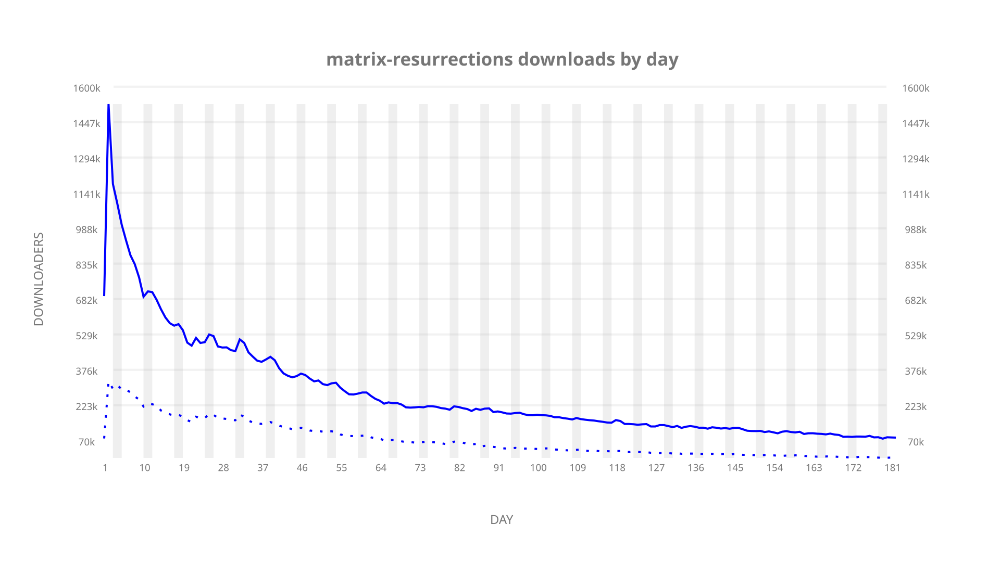
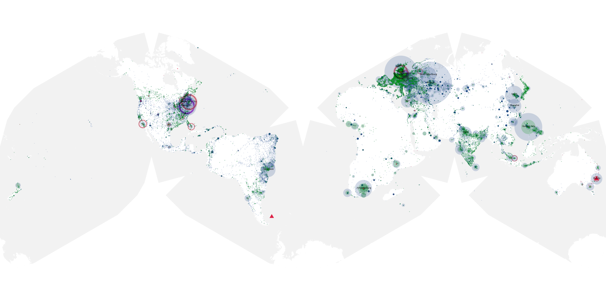
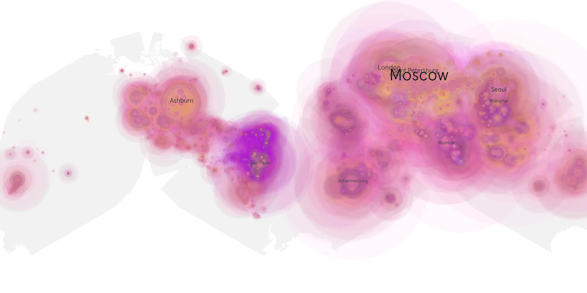
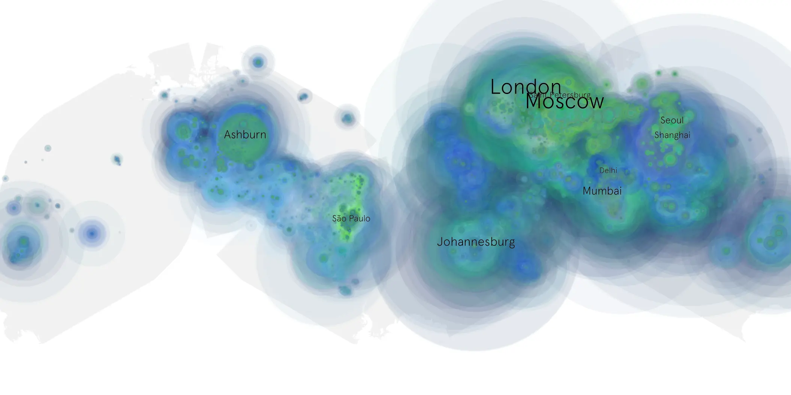

# matrix-resurrections sample cache audit

## 1. Media object

| Field | Value |
| --- | --- |
| Media object | The Matrix Resurrections (2021) |
| Collection key | `matrix-resurrections` |
| imdb_id | [tt10838180](https://www.imdb.com/title/tt10838180/) |
| wikipedia_url | [The Matrix Resurrections](https://en.wikipedia.org/wiki/The_Matrix_Resurrections) |
| Sample dates | 2021-12-22-to-2022-06-21 |
| Sample days | 182 |
| BTIH count | 521 |
| Unique BTIH count | 430 |
| Downloaders total | 40,096,521 |
| Uploaders total | 13,749,939 |
| Data version | `2026-08-05` |
| IP geolocation version | `6:1777968300` |

## 2. Sample coverage report

- Generated: 2026-09-03T11:11:21Z
- Evidence: read-only Day-member stream of the selected cache archive; no raw sample contents were opened
- Required sample span: 2021-12-22 to 2022-06-21 (182 days)
- Cache Day products: 182
- Sparse Day indices: 0
- Post-release Day products: 0

### Sample archive discontinuities

None detected.

## 3. Media objects file size histogram

## 4. Visualization pass — graphs

### Downloads by week cumulative (normalized start)



### Downloads by day, Saturday and Sunday in gray

## 5. Visualization pass — maps

### Cumulative geographic slices

| Africa | Americas | Asia | Europe | Oceania | Unknown |
| --- | --- | --- | --- | --- | --- |
| 8.49 | 17.94 | 27.57 | 36.61 | 2.26 | 0.72 |

### Cumulative network infrastructure

{:target="_blank" rel="noopener"}

### Cumulative data maps

**Cumulative >= 1080p**

{:target="_blank" rel="noopener"}

**Cumulative < 1080p**

{:target="_blank" rel="noopener"}
