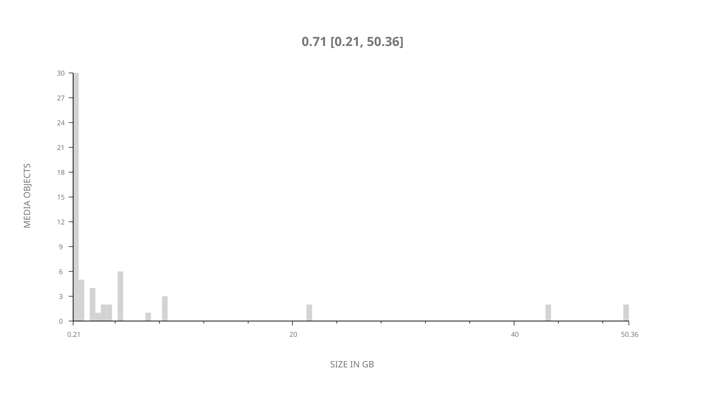
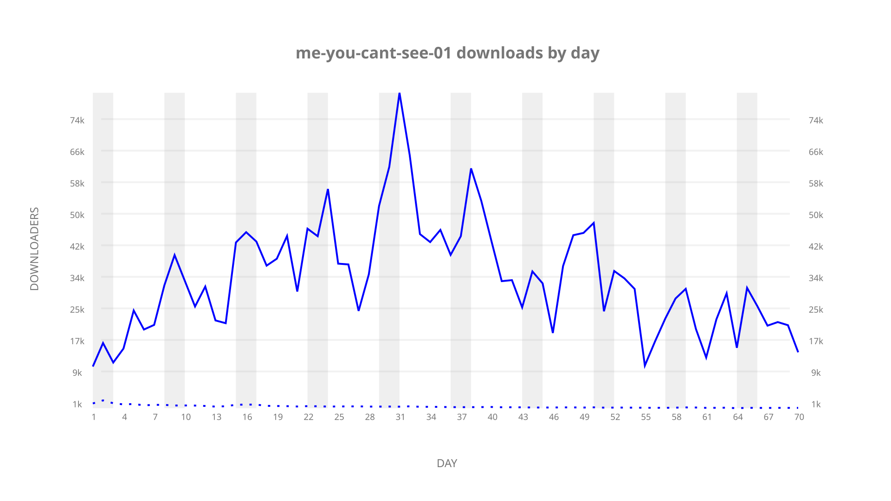
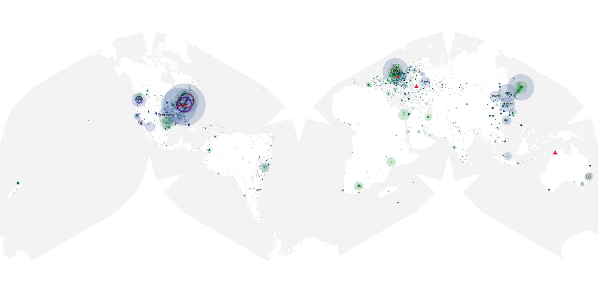
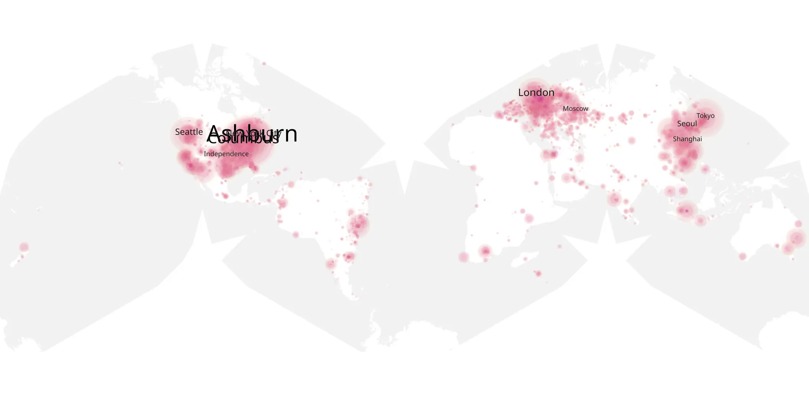
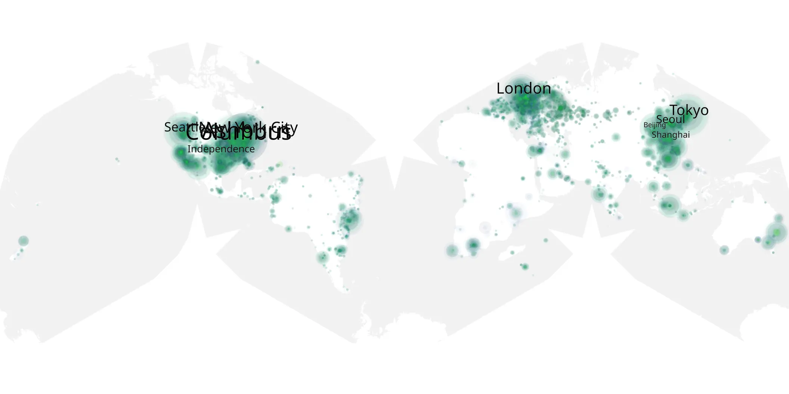

# me-you-cant-see-01 sample cache audit

## 1. Media object

| Field | Value |
| --- | --- |
| Media object | The Me You Can't See |
| Collection key | `me-you-cant-see-01` |
| imdb_id | [tt14584186](https://www.imdb.com/title/tt14584186/) |
| wikipedia_url | [The Me You Can't See](https://en.wikipedia.org/wiki/The_Me_You_Can%27t_See) |
| Sample dates | 2021-05-21-to-2021-07-29 |
| Sample days | 70 |
| BTIH count | 66 |
| Unique BTIH count | 60 |
| Downloaders total | 1,378,198 |
| Uploaders total | 51,610 |
| Data version | `2026-08-05` |
| IP geolocation version | `6:1777968300` |

## 2. Sample coverage report

- Generated: 2026-09-10T15:44:06Z
- Sample archive directory: `/mnt/gold/src/alpha60-samples-raw.gold/me-you-cant-see-01.xz`
- Hour directories: 1663
- Zero-length sample files: 0
- Other unparsable sample files: 0
- Hourly discontinuities: 0 (0 missing hours)
- Missing days: 0

### Sample archive discontinuities

None detected.

## 3. Media objects file size histogram

## 4. Visualization pass — graphs

### Downloads by week cumulative (normalized start)



### Downloads by day, Saturday and Sunday in gray

## 5. Visualization pass — maps

### Cumulative geographic slices

| Africa | Americas | Asia | Europe | Oceania | Unknown |
| --- | --- | --- | --- | --- | --- |
| 2.25 | 39.11 | 17.54 | 21.21 | 1.45 | 11.07 |

### Cumulative network infrastructure

{:target="_blank" rel="noopener"}

### Cumulative data maps

**Cumulative >= 1080p**

{:target="_blank" rel="noopener"}

**Cumulative < 1080p**

{:target="_blank" rel="noopener"}
