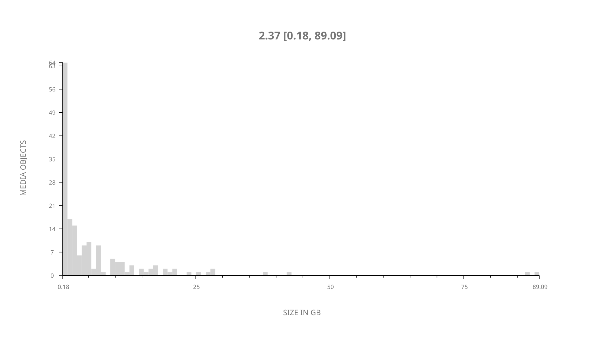
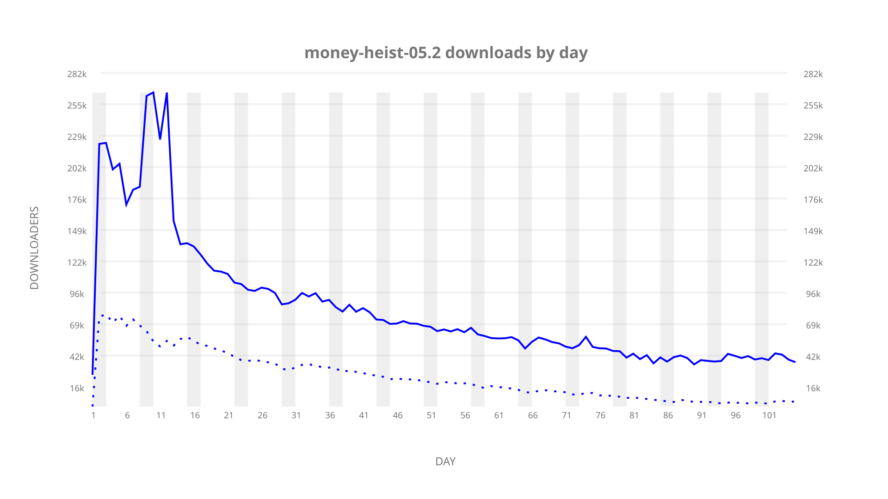
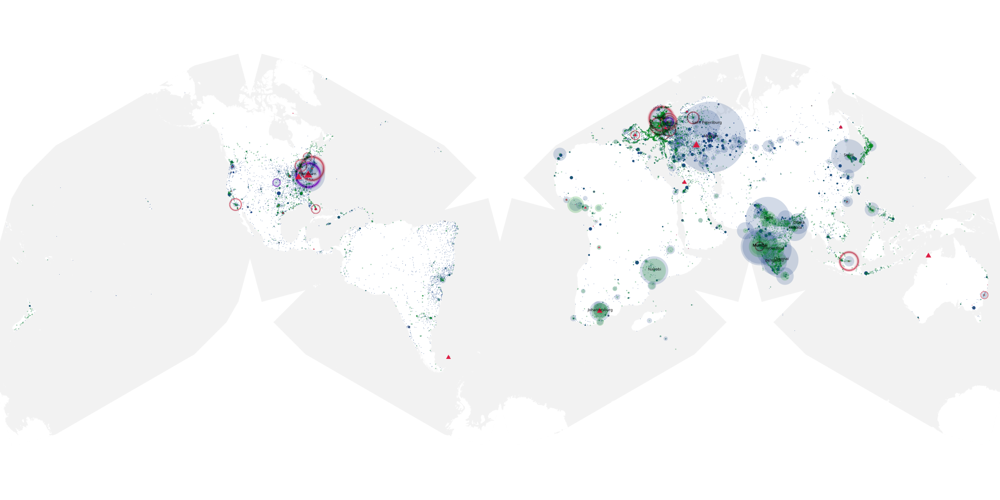
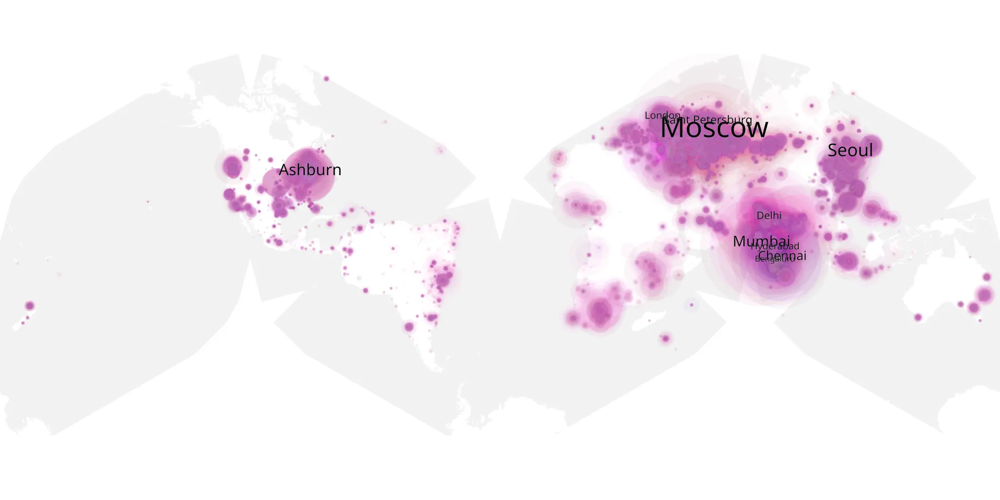
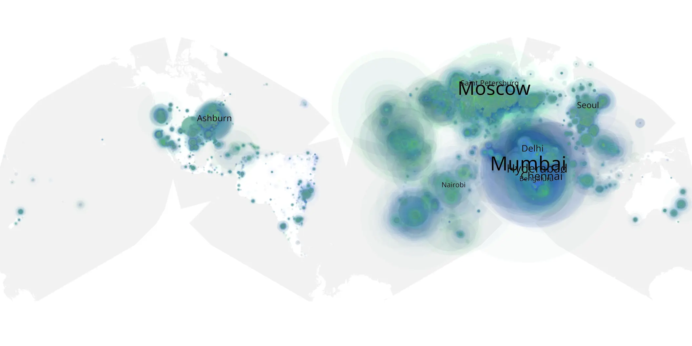

# money-heist-05.2 sample cache audit

## 1. Media object

| Field | Value |
| --- | --- |
| Media object | La Casa De Papel aka Money Heist |
| Collection key | `money-heist-05.2` |
| imdb_id | [tt6468322](https://www.imdb.com/title/tt6468322/) |
| wikipedia_url | [Money Heist](https://en.wikipedia.org/wiki/Money_Heist) |
| Sample dates | 2021-12-03-to-2022-03-17 |
| Sample days | 105 |
| BTIH count | 221 |
| Unique BTIH count | 172 |
| Downloaders total | 8,562,307 |
| Uploaders total | 3,206,928 |
| Data version | `2026-08-05` |
| IP geolocation version | `6:1777968300` |

## 2. Sample coverage report

- Generated: 2026-09-10T15:44:17Z
- Sample archive directory: `/mnt/gold/src/alpha60-samples-raw.gold/money-heist-05.2.xz`
- Hour directories: 2501
- Zero-length sample files: 0
- Other unparsable sample files: 0
- Hourly discontinuities: 0 (0 missing hours)
- Missing days: 0

### Sample archive discontinuities

None detected.

## 3. Media objects file size histogram

## 4. Visualization pass — graphs

### Downloads by week cumulative (normalized start)



### Downloads by day, Saturday and Sunday in gray

## 5. Visualization pass — maps

### Cumulative geographic slices

| Africa | Americas | Asia | Europe | Oceania | Unknown |
| --- | --- | --- | --- | --- | --- |
| 10.39 | 11.65 | 32.01 | 32.62 | 0.63 | 1.81 |

### Cumulative network infrastructure

{:target="_blank" rel="noopener"}

### Cumulative data maps

**Cumulative >= 1080p**

{:target="_blank" rel="noopener"}

**Cumulative < 1080p**

{:target="_blank" rel="noopener"}
