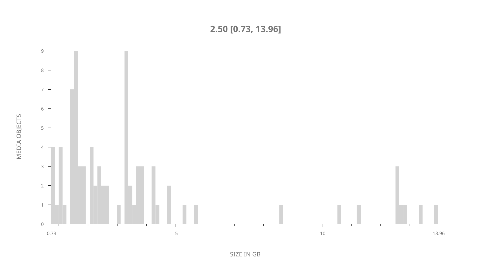
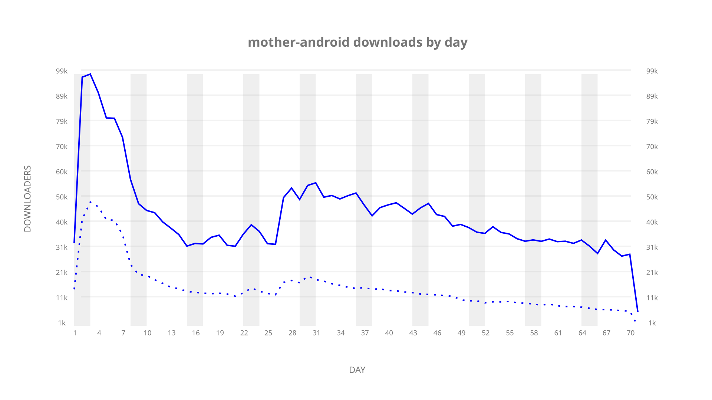
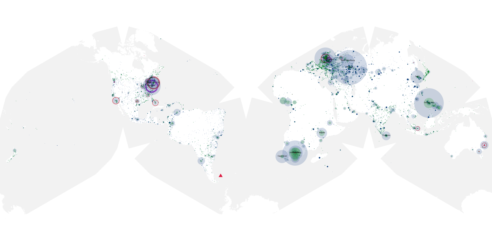
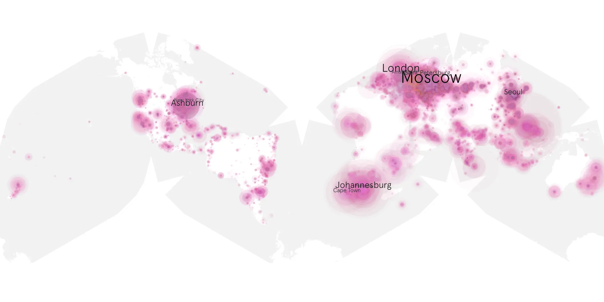
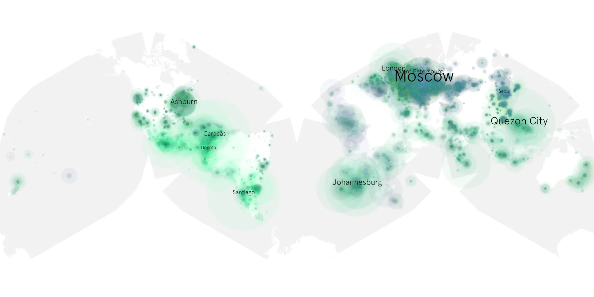

# mother-android sample cache audit

## 1. Media object

| Field | Value |
| --- | --- |
| Media object | Mother/Android |
| Collection key | `mother-android` |
| imdb_id | [tt13029044](https://www.imdb.com/title/tt13029044/) |
| wikipedia_url | [Android](https://en.wikipedia.org/wiki/Mother/Android) |
| Sample dates | 2021-12-17-to-2022-02-25 |
| Sample days | 71 |
| BTIH count | 109 |
| Unique BTIH count | 82 |
| Downloaders total | 2,532,094 |
| Uploaders total | 840,179 |
| Data version | `2026-08-05` |
| IP geolocation version | `6:1777968300` |

## 2. Sample coverage report

- Generated: 2026-09-03T11:11:21Z
- Evidence: read-only Day-member stream of the selected cache archive; no raw sample contents were opened
- Required sample span: 2021-12-17 to 2022-02-25 (71 days)
- Cache Day products: 71
- Sparse Day indices: 0
- Post-release Day products: 0

### Sample archive discontinuities

None detected.

## 3. Media objects file size histogram

## 4. Visualization pass — graphs

### Downloads by week cumulative (normalized start)



### Downloads by day, Saturday and Sunday in gray

## 5. Visualization pass — maps

### Cumulative geographic slices

| Africa | Americas | Asia | Europe | Oceania | Unknown |
| --- | --- | --- | --- | --- | --- |
| 12.74 | 20.00 | 21.37 | 36.54 | 2.34 | 0.67 |

### Cumulative network infrastructure

{:target="_blank" rel="noopener"}

### Cumulative data maps

**Cumulative >= 1080p**

{:target="_blank" rel="noopener"}

**Cumulative < 1080p**

{:target="_blank" rel="noopener"}
