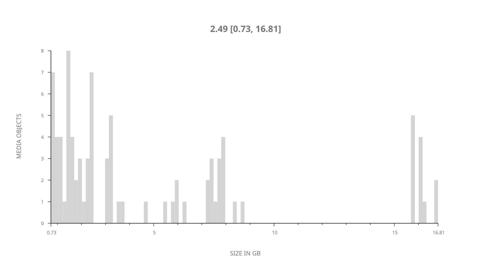
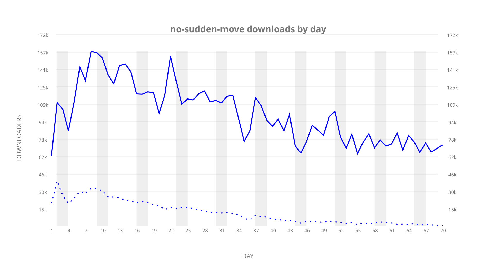
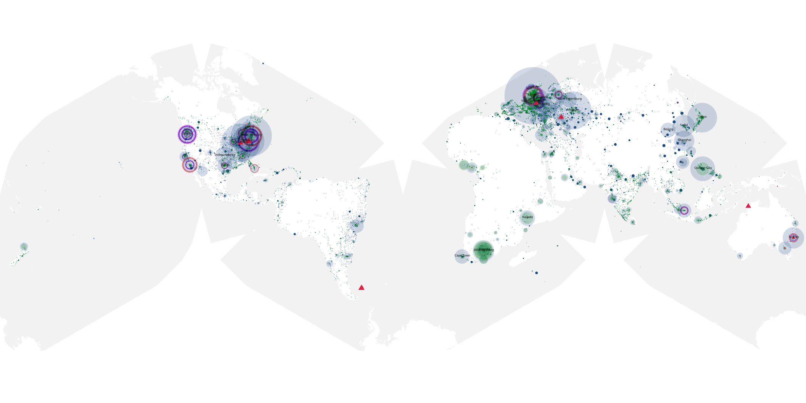
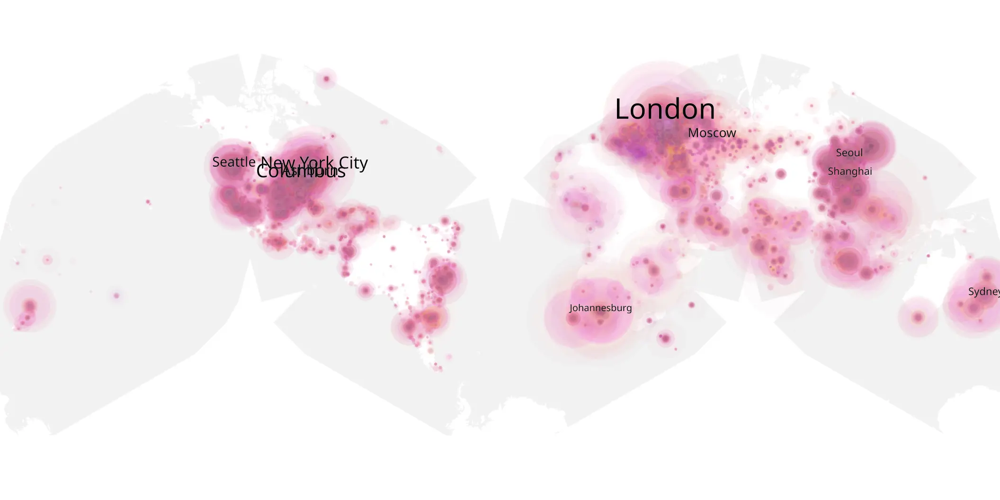
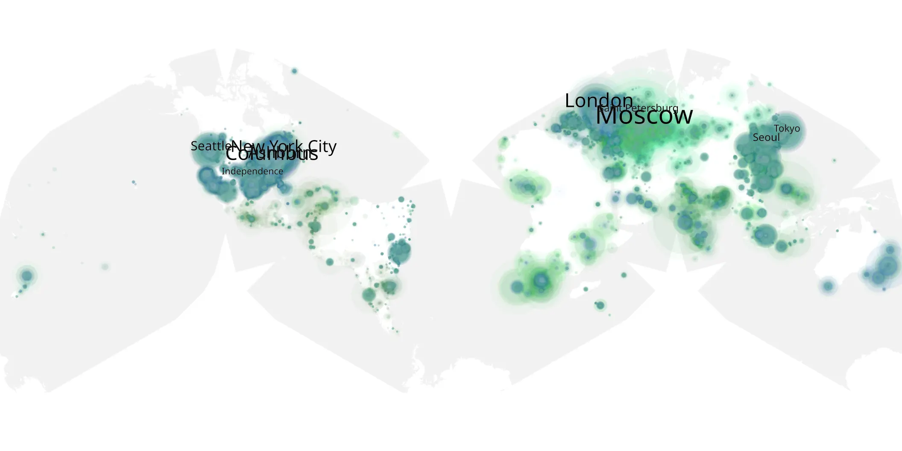

# no-sudden-move sample cache audit

## 1. Media object

| Field | Value |
| --- | --- |
| Media object | No Sudden Move |
| Collection key | `no-sudden-move` |
| imdb_id | [tt11525644](https://www.imdb.com/title/tt11525644/) |
| wikipedia_url | [No Sudden Move](https://en.wikipedia.org/wiki/No_Sudden_Move) |
| Sample dates | 2021-07-01-to-2021-09-08 |
| Sample days | 70 |
| BTIH count | 103 |
| Unique BTIH count | 87 |
| Downloaders total | 5,222,041 |
| Uploaders total | 965,073 |
| Data version | `2026-08-05` |
| IP geolocation version | `6:1777968300` |

## 2. Coverage report

- Generated: 2026-09-03T11:11:21Z
- Evidence: read-only Day-member stream of the selected cache archive; no raw sample contents were opened
- Required sample span: 2021-07-01 to 2021-09-08 (70 days)
- Cache Day products: 70
- Sparse Day indices: 0
- Post-release Day products: 0

### Sample archive discontinuities

None detected.

## 3. File sizes histogram *median[lowest, highest]*

## 4. Graphs

### Downloads by week cumulative (normalized start)



### Downloads by day, Saturday and Sunday in gray

## 5. Cumulative Maps

<!-- https://raw.githubusercontent.com/alpha60-devops/alpha60-results-2021/refs/heads/main/data/ -->

### <a href="https://raw.githubusercontent.com/alpha60-devops/alpha60-results-2021/refs/heads/main/data/geojson.cumulative/no-sudden-move-cumulative-aggregate.geojson.gz" data-map-title="No Sudden Move — no-sudden-move" onclick="leaflet_map_open_window(this.href, this.dataset.mapTitle); return false;" class="table-link" aria-label="Open No Sudden Move (no-sudden-move) cumulative data map in new window" title="Opens interactive map for No Sudden Move (no-sudden-move) data">Swarm Detail</a>

### Geographic Regions

| Africa | Americas | Asia | Europe | Oceania | Unknown |
| --- | --- | --- | --- | --- | --- |
| 6.54 | 28.79 | 19.67 | 29.42 | 2.33 | 6.47 |

### Network infrastructure

{:target="_blank" rel="noopener"}

### Resolution >= 1080p

{:target="_blank" rel="noopener"}

### Resolution < 1080p

{:target="_blank" rel="noopener"}
