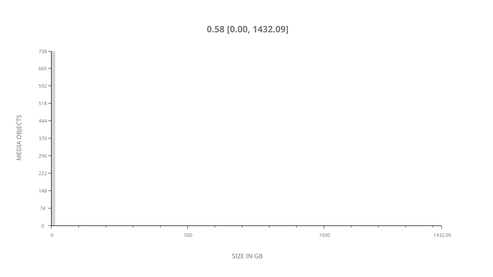
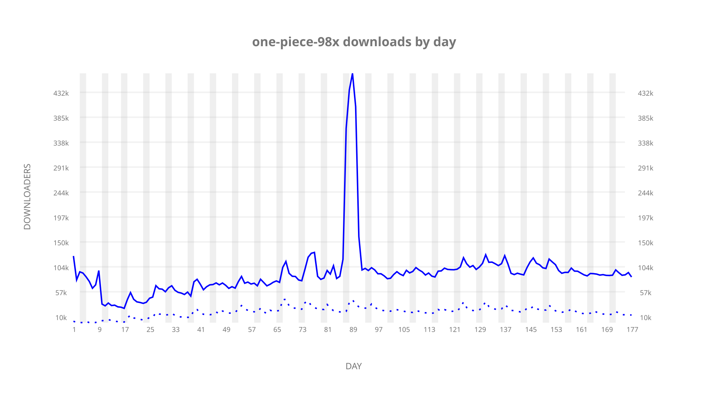
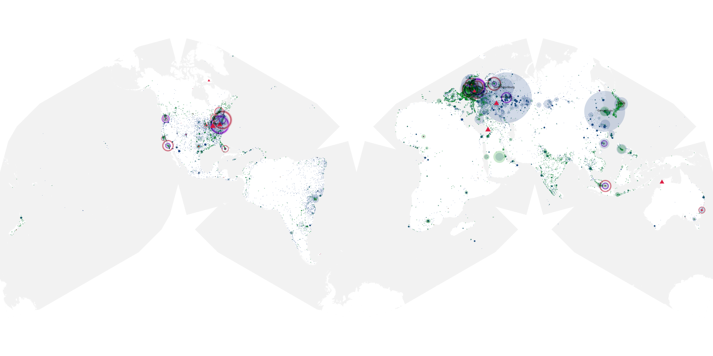
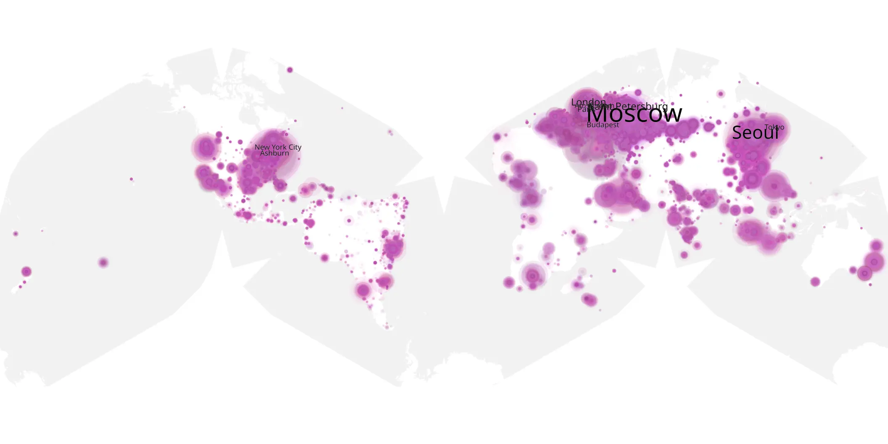
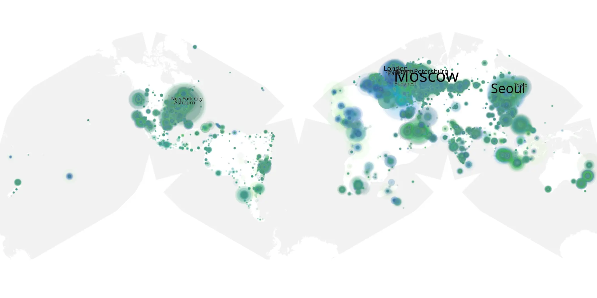

# one-piece-98x sample cache audit

## 1. Media object

| Field | Value |
| --- | --- |
| Media object | One Piece 98x |
| Collection key | `one-piece-98x` |
| imdb_id | [tt0388629](https://www.imdb.com/title/tt0388629/) |
| wikipedia_url | [One Piece (1999 TV series)](https://en.wikipedia.org/wiki/One_Piece_(1999_TV_series)) |
| Sample dates | 2021-09-15-to-2022-03-11 |
| Sample days | 178 |
| BTIH count | 758 |
| Unique BTIH count | 740 |
| Downloaders total | 11,741,997 |
| Uploaders total | 2,023,832 |
| Data version | `2026-08-05` |
| IP geolocation version | `6:1777968300` |

## 2. Sample coverage report

- Generated: 2026-09-03T11:11:21Z
- Evidence: read-only Day-member stream of the selected cache archive; no raw sample contents were opened
- Required sample span: 2021-09-15 to 2022-03-11 (178 days)
- Cache Day products: 177
- Sparse Day indices: 1
- Post-release Day products: 0

### Sample archive discontinuities

- missing Day index 16: `2021-09-30`

## 3. Media objects file size histogram

## 4. Visualization pass — graphs

### Downloads by week cumulative (normalized start)



### Downloads by day, Saturday and Sunday in gray

## 5. Visualization pass — maps

### Cumulative geographic slices

| Africa | Americas | Asia | Europe | Oceania | Unknown |
| --- | --- | --- | --- | --- | --- |
| 4.53 | 19.50 | 24.71 | 46.04 | 1.33 | 3.36 |

### Cumulative network infrastructure

{:target="_blank" rel="noopener"}

### Cumulative data maps

**Cumulative >= 1080p**

{:target="_blank" rel="noopener"}

**Cumulative < 1080p**

{:target="_blank" rel="noopener"}
