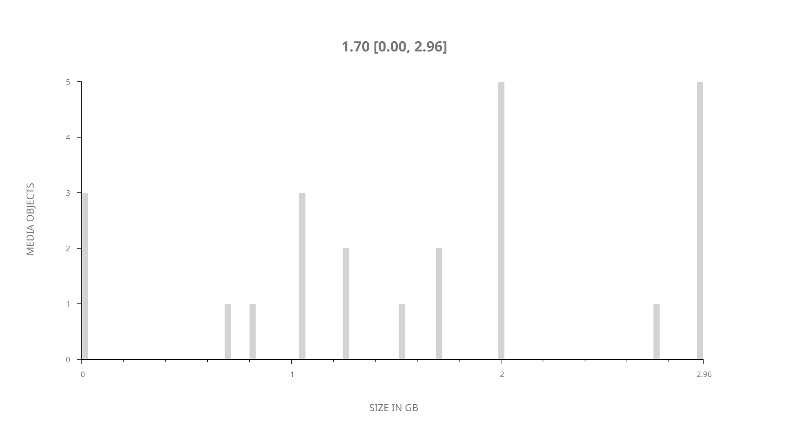
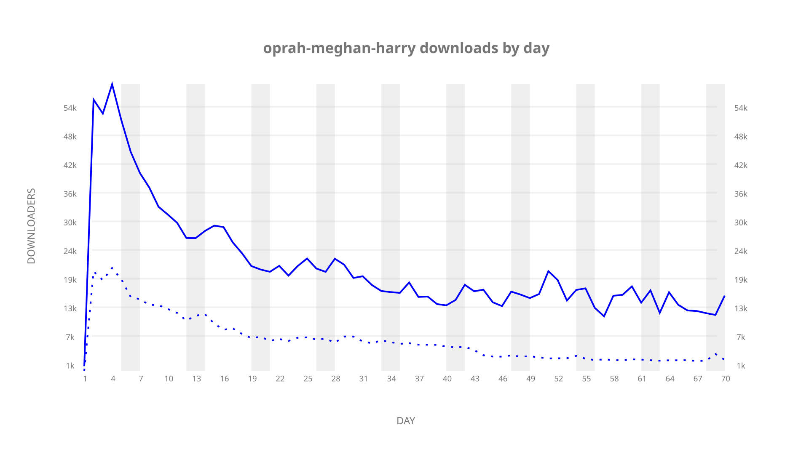
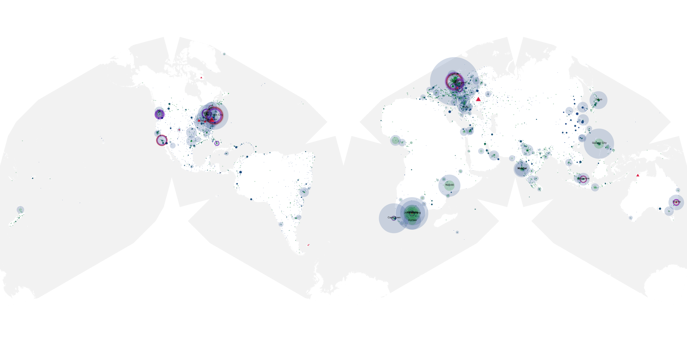
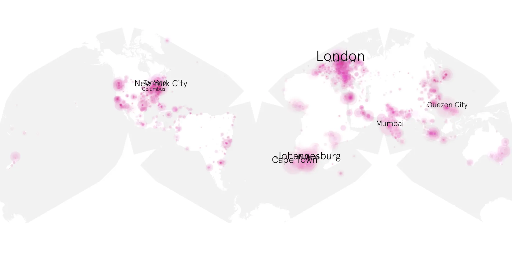
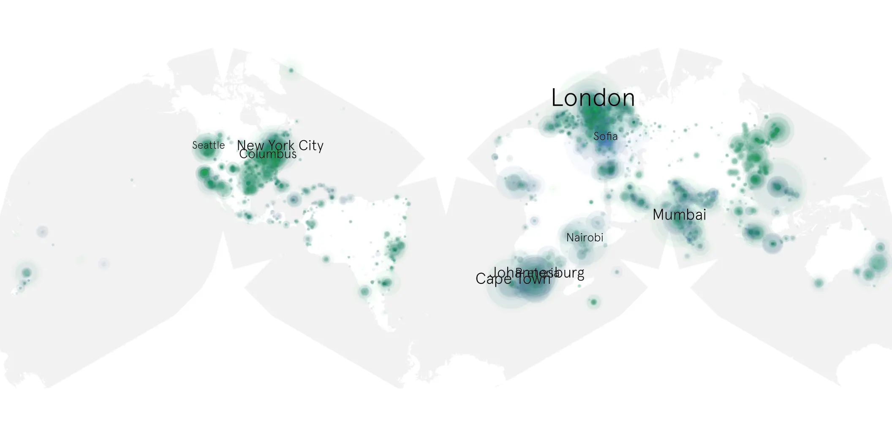

# oprah-meghan-harry sample cache audit

## 1. Media object

| Field | Value |
| --- | --- |
| Media object | Oprah With Meghan and Harry |
| Collection key | `oprah-meghan-harry` |
| imdb_id | [tt14117288](https://www.imdb.com/title/tt14117288/) |
| wikipedia_url | [Oprah with Meghan and Harry](https://en.wikipedia.org/wiki/Oprah_with_Meghan_and_Harry) |
| Sample dates | 2021-03-08-to-2021-05-16 |
| Sample days | 70 |
| BTIH count | 29 |
| Unique BTIH count | 24 |
| Downloaders total | 809,490 |
| Uploaders total | 186,754 |
| Data version | `2026-08-05` |
| IP geolocation version | `6:1777968300` |

## 2. Sample coverage report

- Generated: 2026-09-03T11:11:21Z
- Evidence: read-only Day-member stream of the selected cache archive; no raw sample contents were opened
- Required sample span: 2021-03-08 to 2021-05-16 (70 days)
- Cache Day products: 70
- Sparse Day indices: 0
- Post-release Day products: 0

### Sample archive discontinuities

None detected.

## 3. Media objects file size histogram

## 4. Visualization pass — graphs

### Downloads by week cumulative (normalized start)



### Downloads by day, Saturday and Sunday in gray

## 5. Visualization pass — maps

### Cumulative geographic slices

| Africa | Americas | Asia | Europe | Oceania | Unknown |
| --- | --- | --- | --- | --- | --- |
| 11.82 | 24.30 | 21.35 | 21.17 | 2.17 | 5.04 |

### Cumulative network infrastructure

{:target="_blank" rel="noopener"}

### Cumulative data maps

**Cumulative >= 1080p**

{:target="_blank" rel="noopener"}

**Cumulative < 1080p**

{:target="_blank" rel="noopener"}
