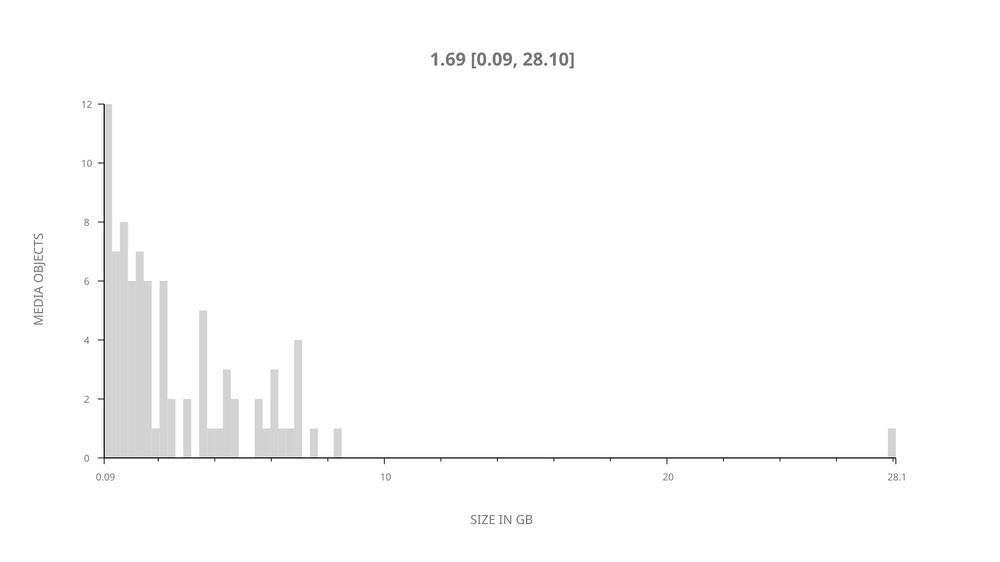
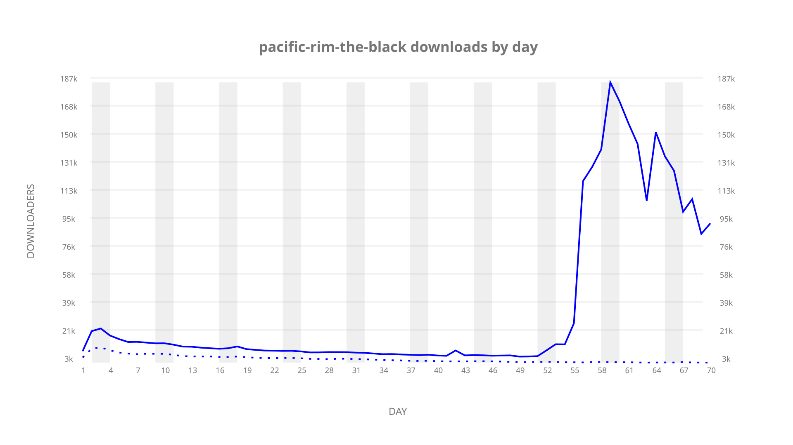
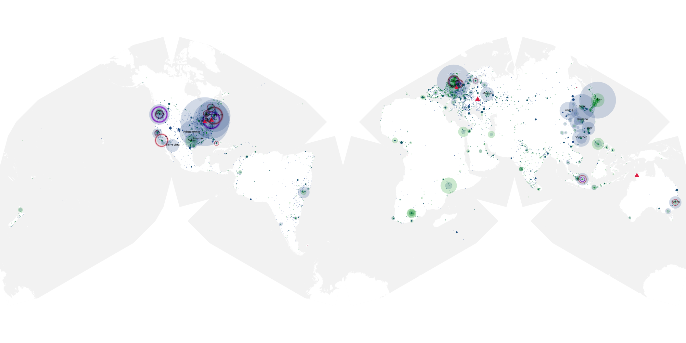
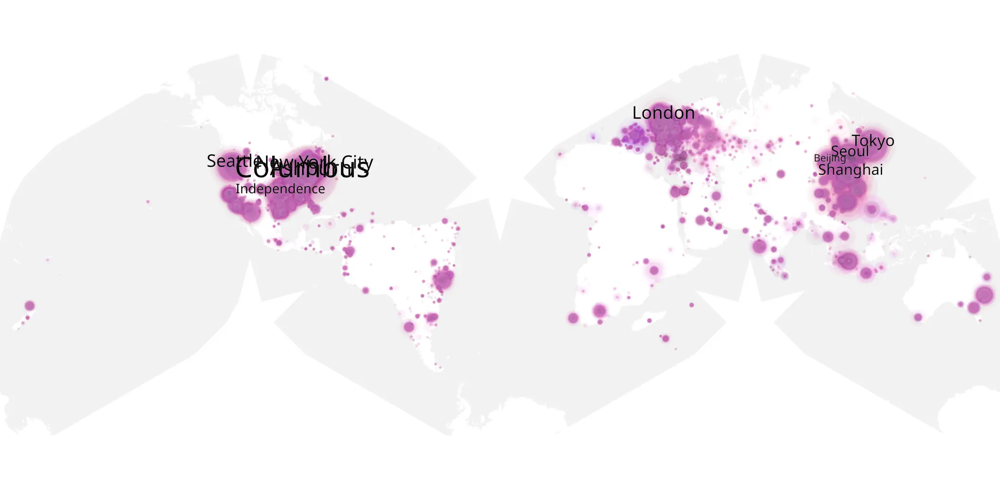
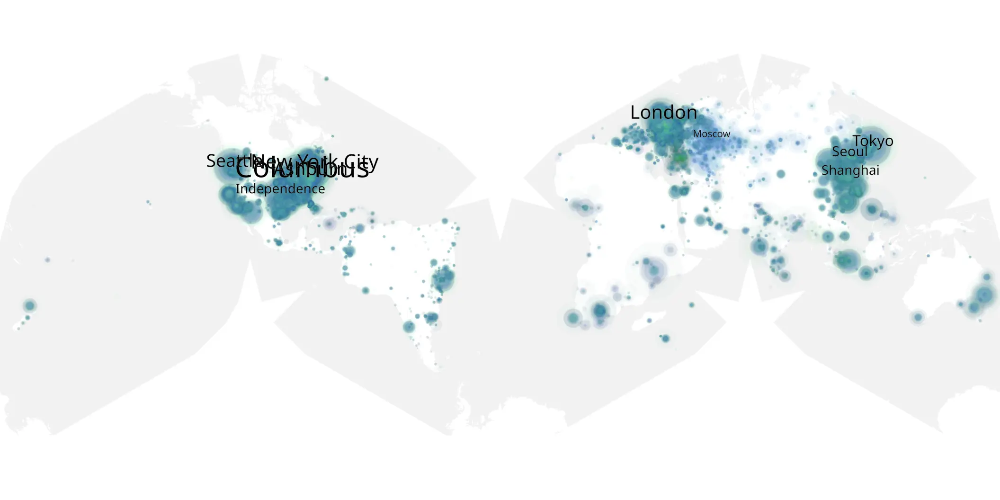

# pacific-rim-the-black sample cache audit

## 1. Media object

| Field | Value |
| --- | --- |
| Media object | Pacific Rim The Black |
| Collection key | `pacific-rim-the-black` |
| imdb_id | [tt9288848](https://www.imdb.com/title/tt9288848/) |
| wikipedia_url | [Pacific Rim: The Black](https://en.wikipedia.org/wiki/Pacific_Rim:_The_Black) |
| Sample dates | 2021-03-04-to-2021-05-12 |
| Sample days | 70 |
| BTIH count | 91 |
| Unique BTIH count | 84 |
| Downloaders total | 1,939,339 |
| Uploaders total | 175,983 |
| Data version | `2026-08-05` |
| IP geolocation version | `6:1777968300` |

## 2. Sample coverage report

- Generated: 2026-09-03T11:11:21Z
- Evidence: read-only Day-member stream of the selected cache archive; no raw sample contents were opened
- Required sample span: 2021-03-04 to 2021-05-12 (70 days)
- Cache Day products: 70
- Sparse Day indices: 0
- Post-release Day products: 0

### Sample archive discontinuities

None detected.

## 3. Media objects file size histogram

## 4. Visualization pass — graphs

### Downloads by week cumulative (normalized start)



### Downloads by day, Saturday and Sunday in gray

## 5. Visualization pass — maps

### Cumulative geographic slices

| Africa | Americas | Asia | Europe | Oceania | Unknown |
| --- | --- | --- | --- | --- | --- |
| 3.09 | 36.96 | 21.20 | 21.53 | 1.56 | 11.17 |

### Cumulative network infrastructure

{:target="_blank" rel="noopener"}

### Cumulative data maps

**Cumulative >= 1080p**

{:target="_blank" rel="noopener"}

**Cumulative < 1080p**

{:target="_blank" rel="noopener"}
