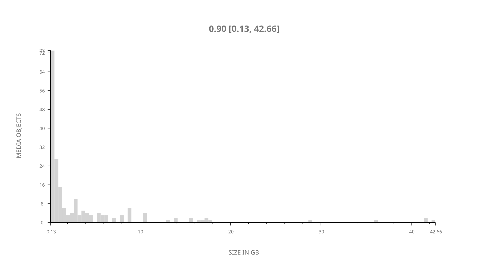
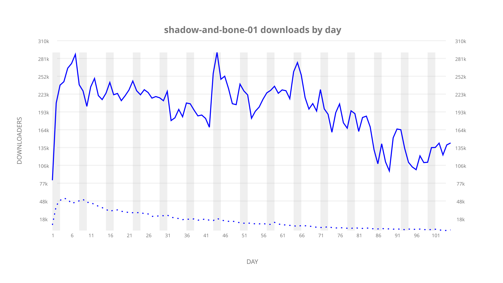
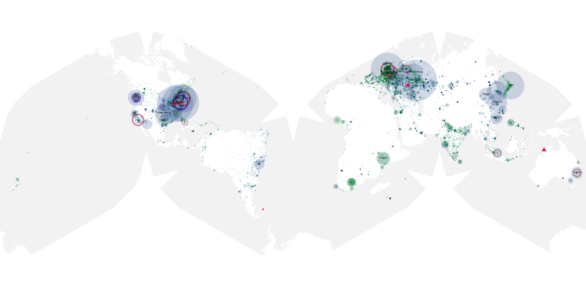
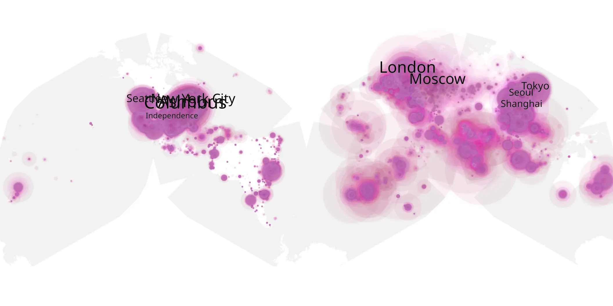
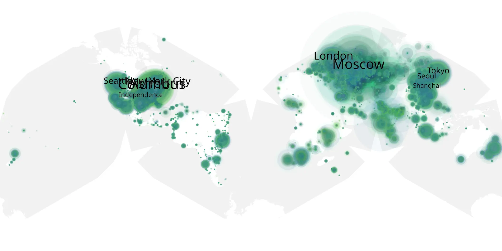

# shadow-and-bone-01 sample cache audit

## 1. Media object

| Field | Value |
| --- | --- |
| Media object | Shadow & Bone |
| Collection key | `shadow-and-bone-01` |
| imdb_id | [tt2403776](https://www.imdb.com/title/tt2403776/) |
| wikipedia_url | [Shadow and Bone (TV series)](https://en.wikipedia.org/wiki/Shadow_and_Bone_(TV_series)) |
| Sample dates | 2021-04-23-to-2021-08-05 |
| Sample days | 105 |
| BTIH count | 220 |
| Unique BTIH count | 193 |
| Downloaders total | 13,201,358 |
| Uploaders total | 2,299,409 |
| Data version | `2026-08-05` |
| IP geolocation version | `6:1777968300` |

## 2. Sample coverage report

- Generated: 2026-09-03T11:11:21Z
- Evidence: read-only Day-member stream of the selected cache archive; no raw sample contents were opened
- Required sample span: 2021-04-23 to 2021-08-05 (105 days)
- Cache Day products: 105
- Sparse Day indices: 0
- Post-release Day products: 0

### Sample archive discontinuities

None detected.

## 3. Media objects file size histogram

## 4. Visualization pass — graphs

### Downloads by week cumulative (normalized start)



### Downloads by day, Saturday and Sunday in gray

## 5. Visualization pass — maps

### Cumulative geographic slices

| Africa | Americas | Asia | Europe | Oceania | Unknown |
| --- | --- | --- | --- | --- | --- |
| 3.99 | 30.62 | 19.61 | 31.89 | 1.51 | 8.35 |

### Cumulative network infrastructure

{:target="_blank" rel="noopener"}

### Cumulative data maps

**Cumulative >= 1080p**

{:target="_blank" rel="noopener"}

**Cumulative < 1080p**

{:target="_blank" rel="noopener"}
