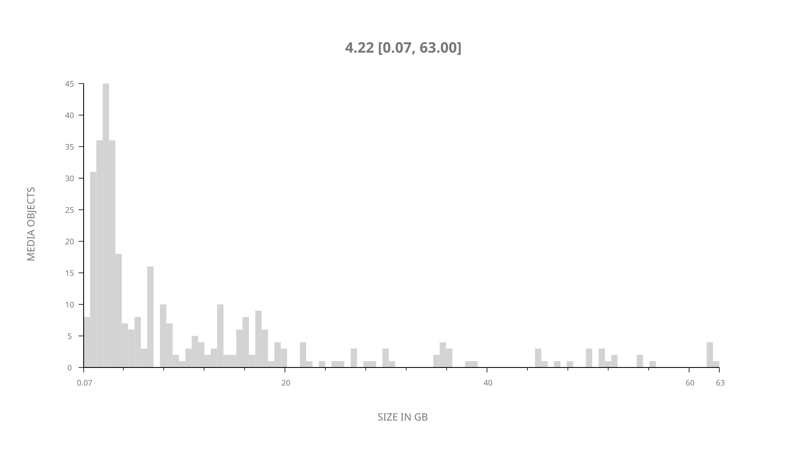
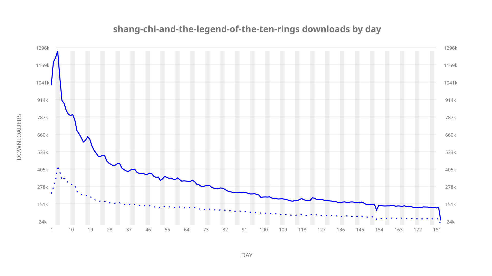
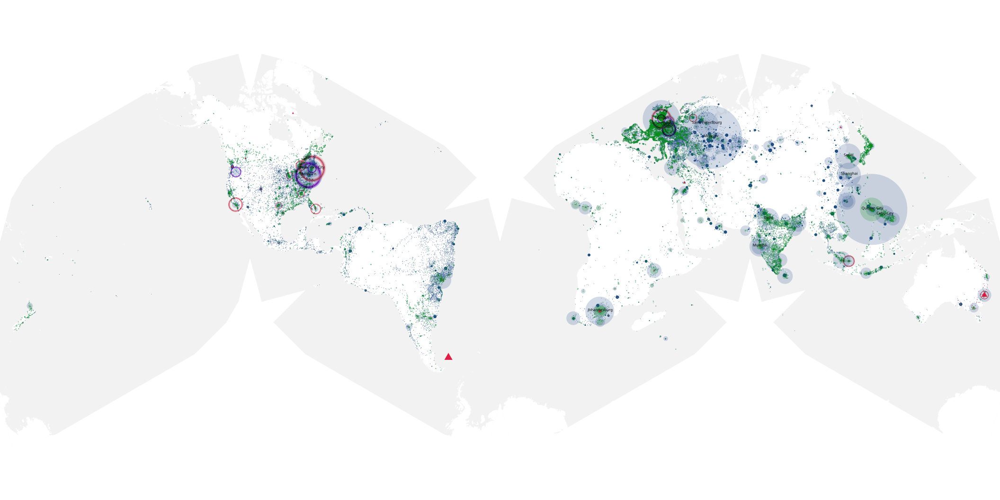
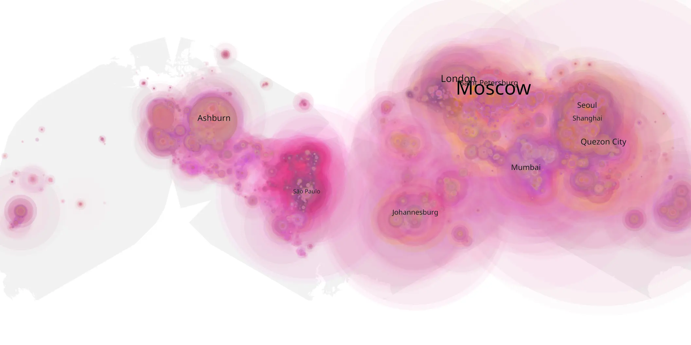
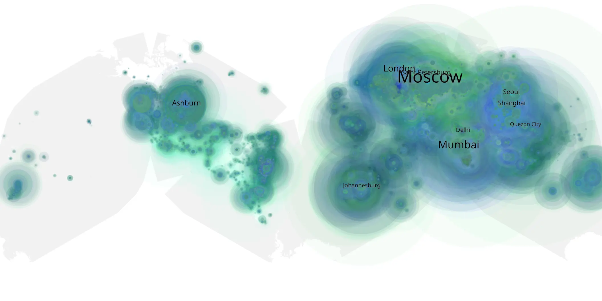

# shang-chi-and-the-legend-of-the-ten-rings sample cache audit

## 1. Media object

| Field | Value |
| --- | --- |
| Media object | Shang Chi and the Legend of the Ten Rings |
| Collection key | `shang-chi-and-the-legend-of-the-ten-rings` |
| imdb_id | [tt9376612](https://www.imdb.com/title/tt9376612/) |
| wikipedia_url | [Shang-Chi and the Legend of the Ten Rings](https://en.wikipedia.org/wiki/Shang-Chi_and_the_Legend_of_the_Ten_Rings) |
| Sample dates | 2021-11-10-to-2022-05-11 |
| Sample days | 183 |
| BTIH count | 440 |
| Unique BTIH count | 355 |
| Downloaders total | 39,580,849 |
| Uploaders total | 14,224,766 |
| Data version | `2026-08-05` |
| IP geolocation version | `6:1777968300` |

## 2. Sample coverage report

- Generated: 2026-09-03T11:11:21Z
- Evidence: read-only Day-member stream of the selected cache archive; no raw sample contents were opened
- Required sample span: 2021-11-10 to 2022-05-11 (183 days)
- Cache Day products: 183
- Sparse Day indices: 0
- Post-release Day products: 0

### Sample archive discontinuities

None detected.

## 3. Media objects file size histogram

## 4. Visualization pass — graphs

### Downloads by week cumulative (normalized start)



### Downloads by day, Saturday and Sunday in gray

## 5. Visualization pass — maps

### Cumulative geographic slices

| Africa | Americas | Asia | Europe | Oceania | Unknown |
| --- | --- | --- | --- | --- | --- |
| 7.70 | 16.04 | 34.03 | 33.00 | 1.71 | 0.84 |

### Cumulative network infrastructure

{:target="_blank" rel="noopener"}

### Cumulative data maps

**Cumulative >= 1080p**

{:target="_blank" rel="noopener"}

**Cumulative < 1080p**

{:target="_blank" rel="noopener"}
