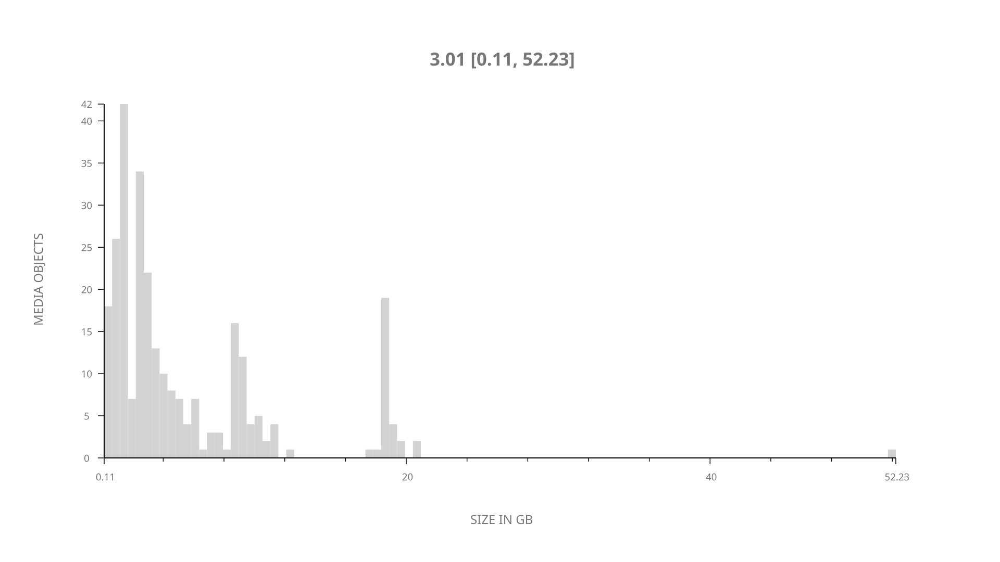
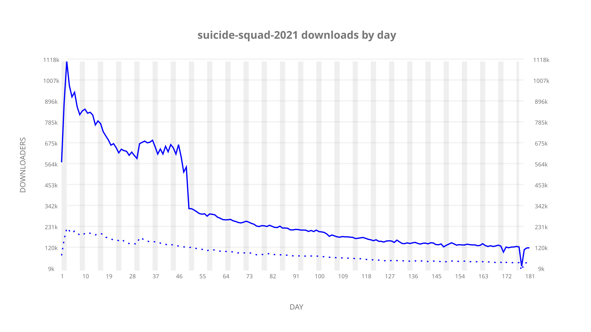
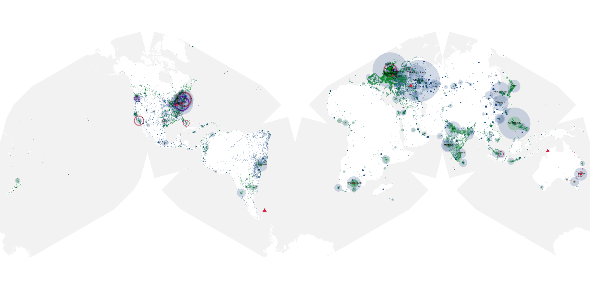
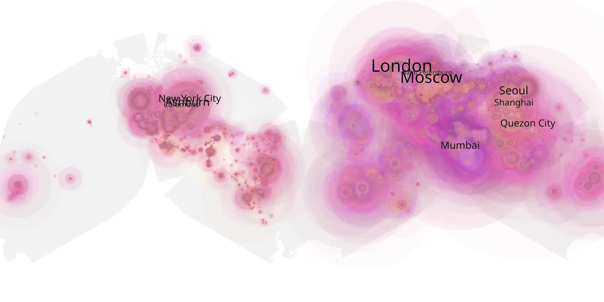
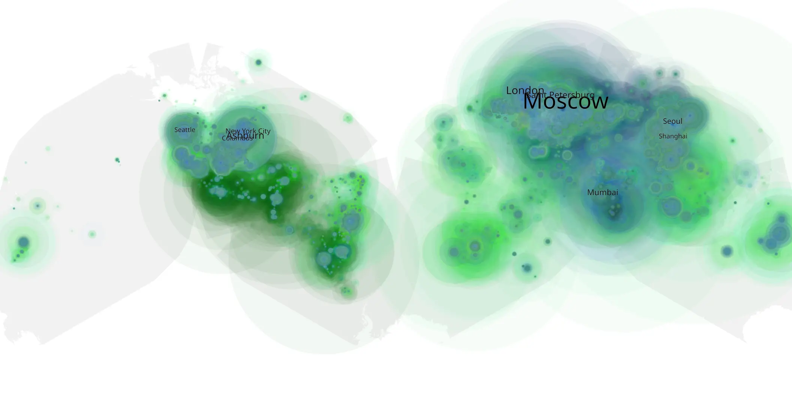

# suicide-squad-2021 sample cache audit

## 1. Media object

| Field | Value |
| --- | --- |
| Media object | Suicide Squad |
| Collection key | `suicide-squad-2021` |
| imdb_id | [tt6334354](https://www.imdb.com/title/tt6334354/) |
| wikipedia_url | [The Suicide Squad (film)](https://en.wikipedia.org/wiki/The_Suicide_Squad_(film)) |
| Sample dates | 2021-08-06-to-2022-02-03 |
| Sample days | 182 |
| BTIH count | 306 |
| Unique BTIH count | 280 |
| Downloaders total | 31,993,818 |
| Uploaders total | 7,987,300 |
| Data version | `2026-08-05` |
| IP geolocation version | `6:1777968300` |

## 2. Sample coverage report

- Generated: 2026-09-03T11:11:21Z
- Evidence: read-only Day-member stream of the selected cache archive; no raw sample contents were opened
- Required sample span: 2021-08-06 to 2022-02-03 (182 days)
- Cache Day products: 181
- Sparse Day indices: 1
- Post-release Day products: 0

### Sample archive discontinuities

- missing Day index 178: `2022-01-30`

## 3. Media objects file size histogram

## 4. Visualization pass — graphs

### Downloads by week cumulative (normalized start)



### Downloads by day, Saturday and Sunday in gray

## 5. Visualization pass — maps

### Cumulative geographic slices

| Africa | Americas | Asia | Europe | Oceania | Unknown |
| --- | --- | --- | --- | --- | --- |
| 5.60 | 22.00 | 26.64 | 31.91 | 1.91 | 3.53 |

### Cumulative network infrastructure

{:target="_blank" rel="noopener"}

### Cumulative data maps

**Cumulative >= 1080p**

{:target="_blank" rel="noopener"}

**Cumulative < 1080p**

{:target="_blank" rel="noopener"}
