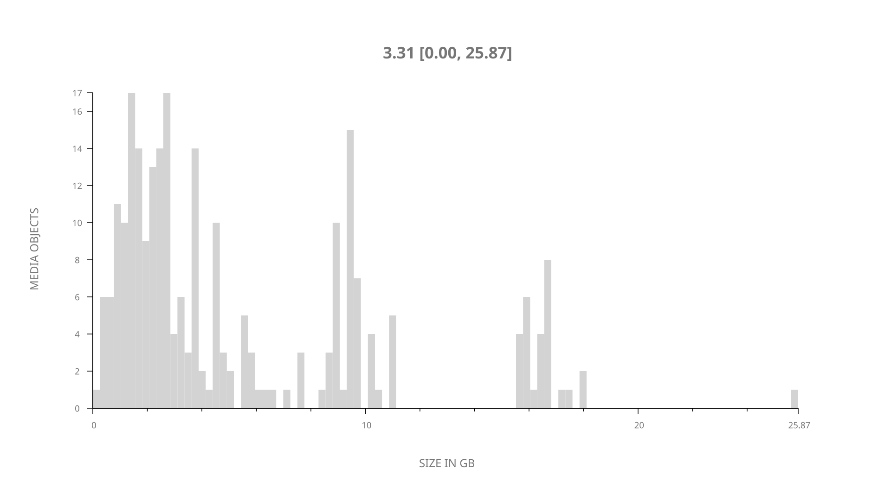
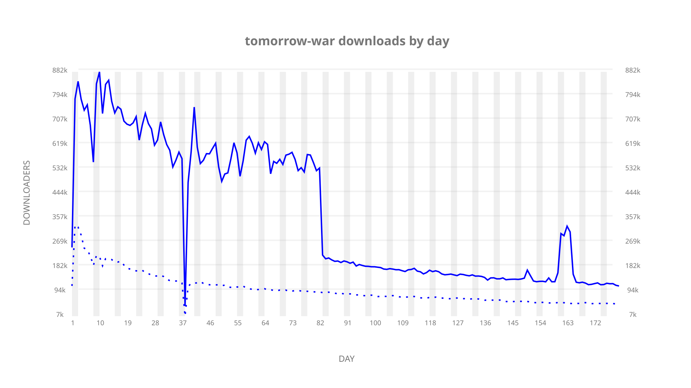
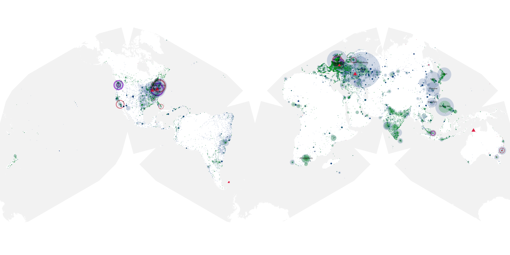
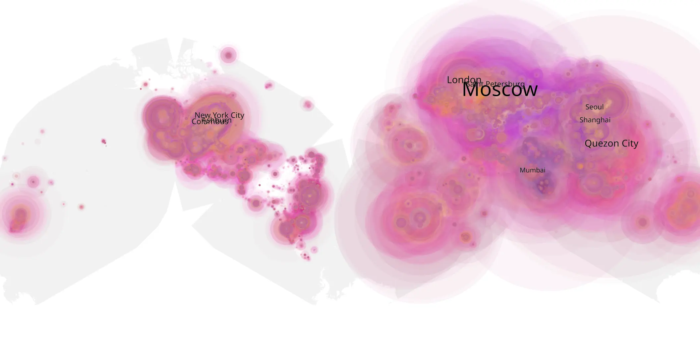
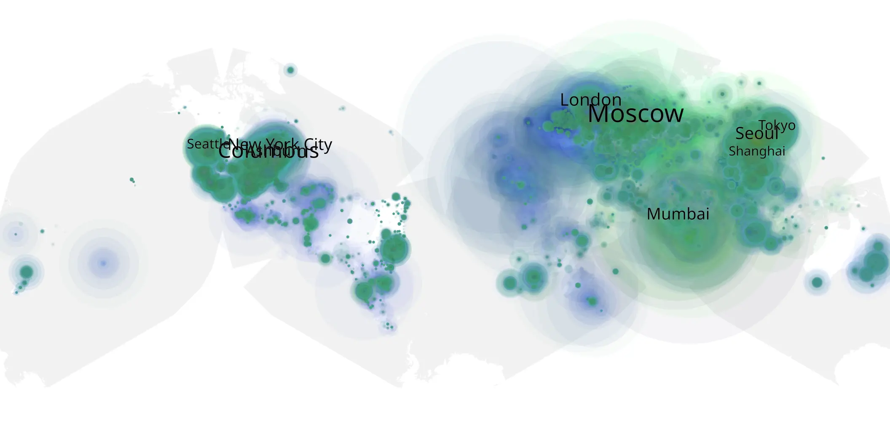

# tomorrow-war sample cache audit

## 1. Media object

| Field | Value |
| --- | --- |
| Media object | The Tomorrow War |
| Collection key | `tomorrow-war` |
| imdb_id | [tt9777666](https://www.imdb.com/title/tt9777666/) |
| wikipedia_url | [The Tomorrow War](https://en.wikipedia.org/wiki/The_Tomorrow_War) |
| Sample dates | 2021-07-02-to-2021-12-30 |
| Sample days | 182 |
| BTIH count | 275 |
| Unique BTIH count | 253 |
| Downloaders total | 34,429,787 |
| Uploaders total | 8,884,945 |
| Data version | `2026-08-05` |
| IP geolocation version | `6:1777968300` |

## 2. Sample coverage report

- Generated: 2026-09-03T11:11:21Z
- Evidence: read-only Day-member stream of the selected cache archive; no raw sample contents were opened
- Required sample span: 2021-07-02 to 2021-12-30 (182 days)
- Cache Day products: 180
- Sparse Day indices: 2
- Post-release Day products: 0

### Sample archive discontinuities

- missing Day index 39: `2021-08-09`
- missing Day index 40: `2021-08-10`

## 3. Media objects file size histogram

## 4. Visualization pass — graphs

### Downloads by week cumulative (normalized start)



### Downloads by day, Saturday and Sunday in gray

## 5. Visualization pass — maps

### Cumulative geographic slices

| Africa | Americas | Asia | Europe | Oceania | Unknown |
| --- | --- | --- | --- | --- | --- |
| 6.65 | 21.50 | 25.59 | 33.79 | 1.57 | 5.32 |

### Cumulative network infrastructure

{:target="_blank" rel="noopener"}

### Cumulative data maps

**Cumulative >= 1080p**

{:target="_blank" rel="noopener"}

**Cumulative < 1080p**

{:target="_blank" rel="noopener"}
