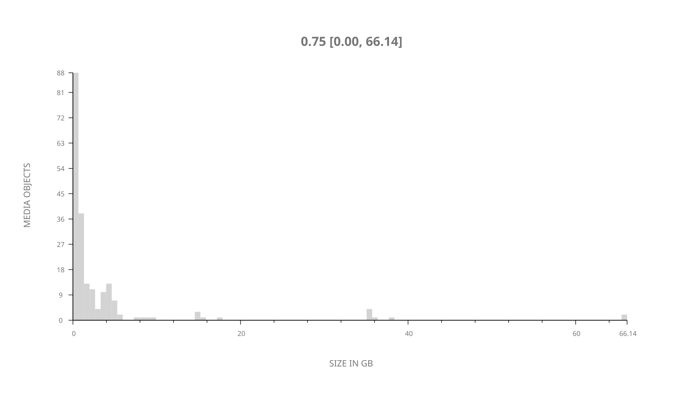
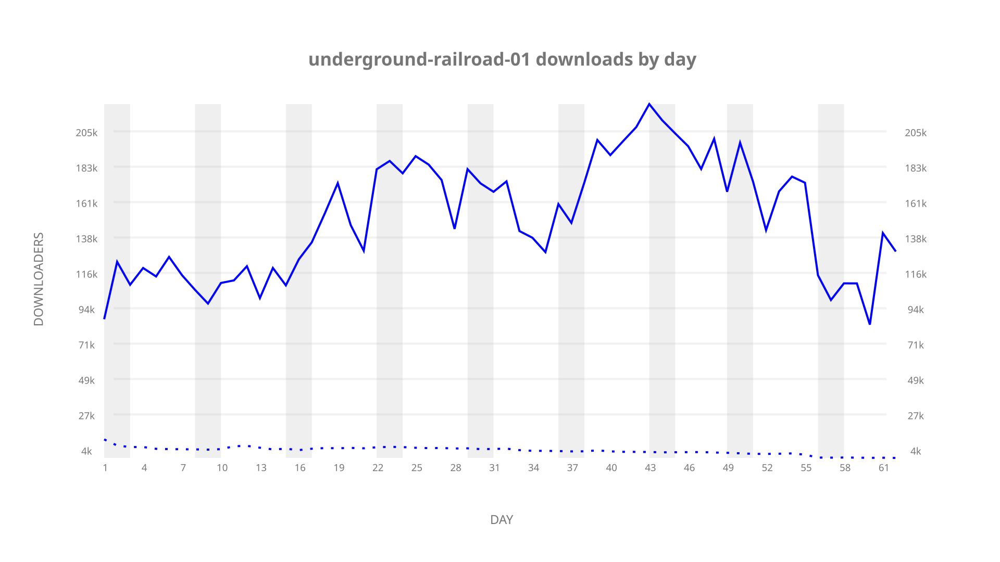
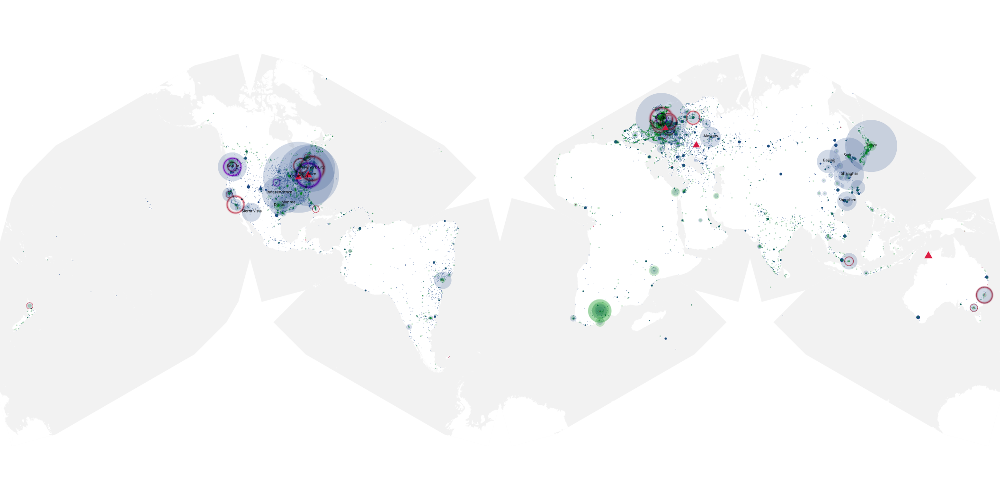
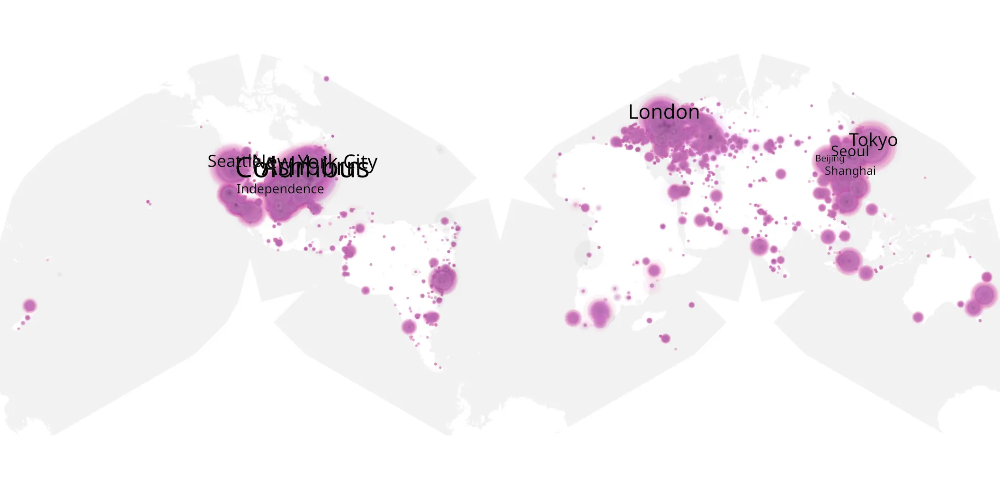
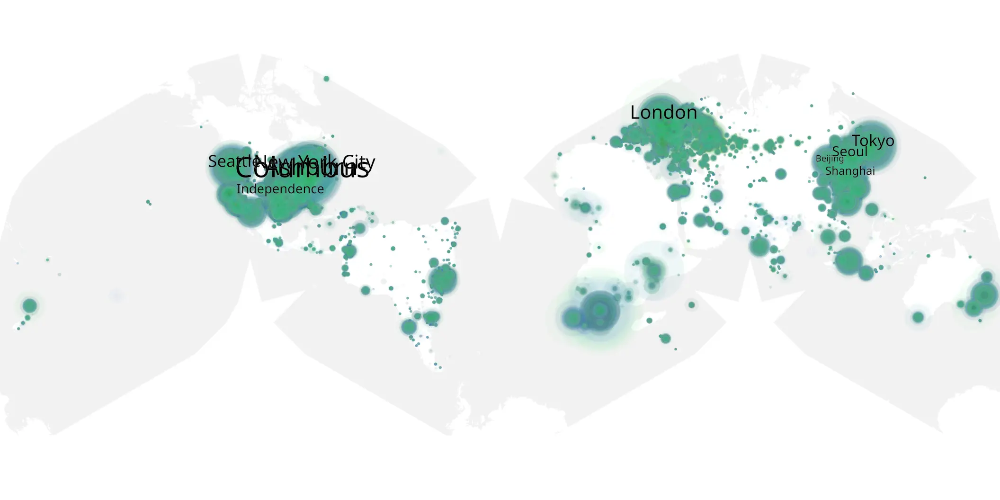

# underground-railroad-01 sample cache audit

## 1. Media object

| Field | Value |
| --- | --- |
| Media object | Underground Railroad |
| Collection key | `underground-railroad-01` |
| imdb_id | [tt6704972](https://www.imdb.com/title/tt6704972/) |
| wikipedia_url | [The Underground Railroad (miniseries)](https://en.wikipedia.org/wiki/The_Underground_Railroad_(miniseries)) |
| Sample dates | 2021-05-14-to-2021-07-22 |
| Sample days | 70 |
| BTIH count | 206 |
| Unique BTIH count | 203 |
| Downloaders total | 5,918,036 |
| Uploaders total | 272,314 |
| Data version | `2026-08-05` |
| IP geolocation version | `6:1777968300` |

## 2. Coverage report

- Generated: 2026-09-03T11:11:21Z
- Evidence: read-only Day-member stream of the selected cache archive; no raw sample contents were opened
- Required sample span: 2021-05-14 to 2021-07-22 (70 days)
- Cache Day products: 62
- Sparse Day indices: 8
- Post-release Day products: 0

### Sample archive discontinuities

- missing Day index 49: `2021-07-01`
- missing Day index 50: `2021-07-02`
- missing Day index 51: `2021-07-03`
- missing Day index 52: `2021-07-04`
- missing Day index 53: `2021-07-05`
- missing Day index 54: `2021-07-06`
- missing Day index 55: `2021-07-07`
- missing Day index 56: `2021-07-08`

## 3. File sizes histogram *median[lowest, highest]*

## 4. Graphs

### Downloads by week cumulative (normalized start)



### Downloads by day, Saturday and Sunday in gray

## 5. Cumulative Maps

<!-- https://raw.githubusercontent.com/alpha60-devops/alpha60-results-2021/refs/heads/main/data/ -->

### <a href="https://raw.githubusercontent.com/alpha60-devops/alpha60-results-2021/refs/heads/main/data/geojson.cumulative/underground-railroad-01-cumulative-aggregate.geojson.gz" data-map-title="Underground Railroad — underground-railroad-01" onclick="leaflet_map_open_window(this.href, this.dataset.mapTitle); return false;" class="table-link" aria-label="Open Underground Railroad (underground-railroad-01) cumulative data map in new window" title="Opens interactive map for Underground Railroad (underground-railroad-01) data">Swarm Detail</a>

### Geographic Regions

| Africa | Americas | Asia | Europe | Oceania | Unknown |
| --- | --- | --- | --- | --- | --- |
| 3.76 | 40.21 | 18.33 | 22.07 | 1.56 | 11.64 |

### Network infrastructure

{:target="_blank" rel="noopener"}

### Resolution >= 1080p

{:target="_blank" rel="noopener"}

### Resolution < 1080p

{:target="_blank" rel="noopener"}
