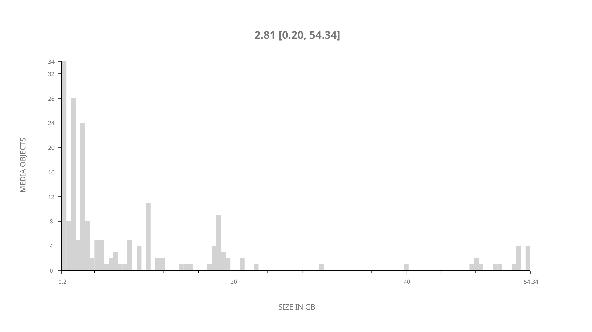
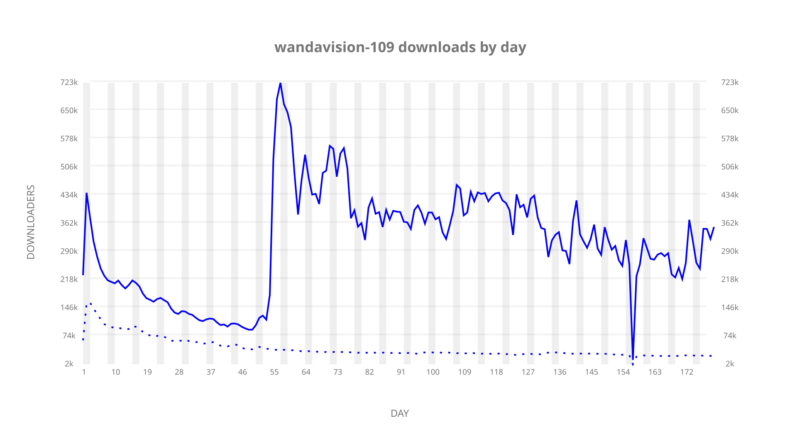
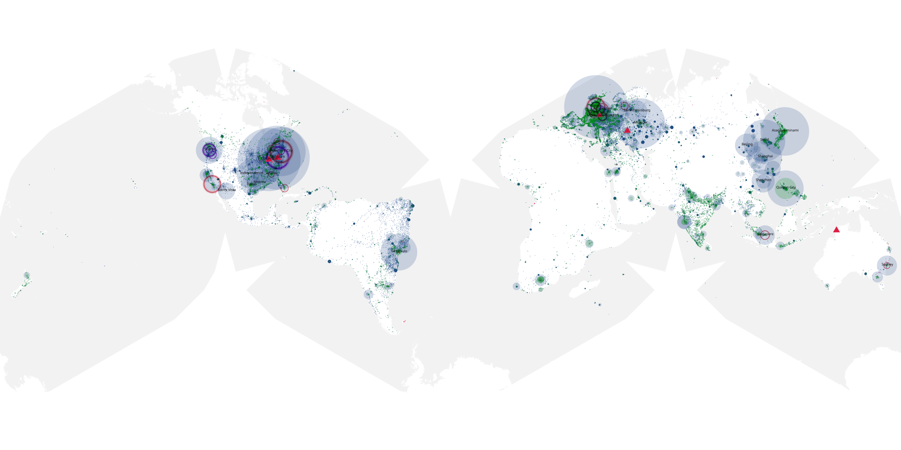
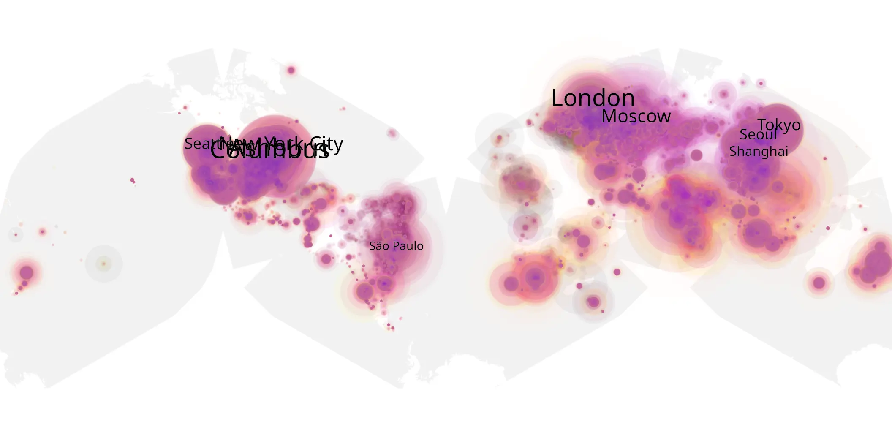
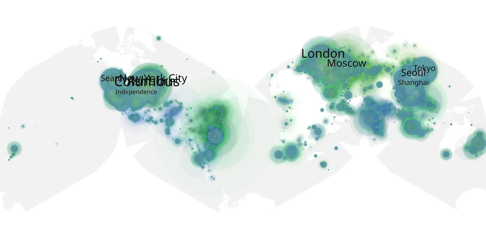

# wandavision-109 sample cache audit

## 1. Media object

| Field | Value |
| --- | --- |
| Media object | WandaVision |
| Collection key | `wandavision-109` |
| imdb_id | [tt9140560](https://www.imdb.com/title/tt9140560/) |
| wikipedia_url | [WandaVision](https://en.wikipedia.org/wiki/WandaVision) |
| Sample dates | 2021-03-05-to-2021-09-02 |
| Sample days | 182 |
| BTIH count | 219 |
| Unique BTIH count | 193 |
| Downloaders total | 24,535,631 |
| Uploaders total | 3,898,491 |
| Data version | `2026-08-05` |
| IP geolocation version | `6:1777968300` |

## 2. Coverage report

- Generated: 2026-09-03T11:11:21Z
- Evidence: read-only Day-member stream of the selected cache archive; no raw sample contents were opened
- Required sample span: 2021-03-05 to 2021-09-02 (182 days)
- Cache Day products: 180
- Sparse Day indices: 2
- Post-release Day products: 0

### Sample archive discontinuities

- missing Day index 158: `2021-08-09`
- missing Day index 159: `2021-08-10`

## 3. File sizes histogram *median[lowest, highest]*

## 4. Graphs

### Downloads by week cumulative (normalized start)



### Downloads by day, Saturday and Sunday in gray

## 5. Cumulative Maps

<!-- https://raw.githubusercontent.com/alpha60-devops/alpha60-results-2021/refs/heads/main/data/ -->

### <a href="https://raw.githubusercontent.com/alpha60-devops/alpha60-results-2021/refs/heads/main/data/geojson.cumulative/wandavision-109-cumulative-aggregate.geojson.gz" data-map-title="WandaVision — wandavision-109" onclick="leaflet_map_open_window(this.href, this.dataset.mapTitle); return false;" class="table-link" aria-label="Open WandaVision (wandavision-109) cumulative data map in new window" title="Opens interactive map for WandaVision (wandavision-109) data">Swarm Detail</a>

### Geographic Regions

| Africa | Americas | Asia | Europe | Oceania | Unknown |
| --- | --- | --- | --- | --- | --- |
| 3.00 | 35.72 | 22.23 | 26.27 | 1.47 | 8.06 |

### Network infrastructure

{:target="_blank" rel="noopener"}

### Resolution >= 1080p

{:target="_blank" rel="noopener"}

### Resolution < 1080p

{:target="_blank" rel="noopener"}
