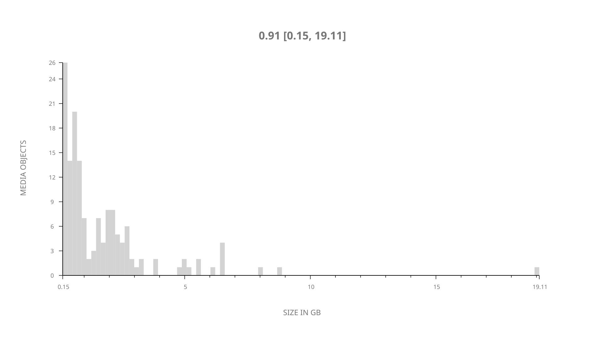
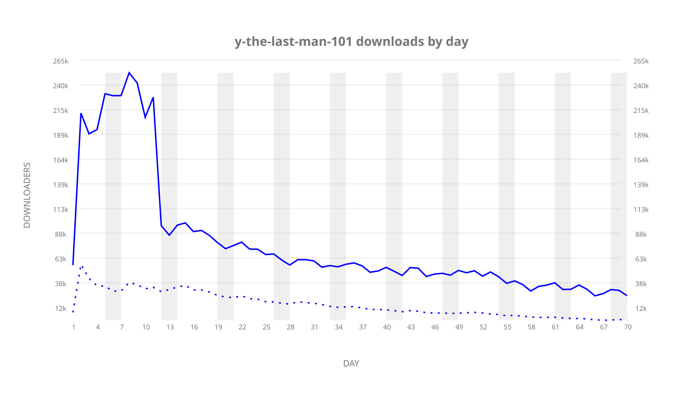
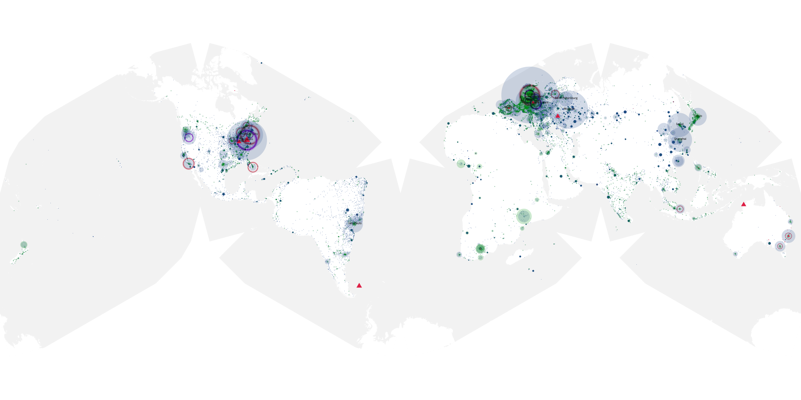
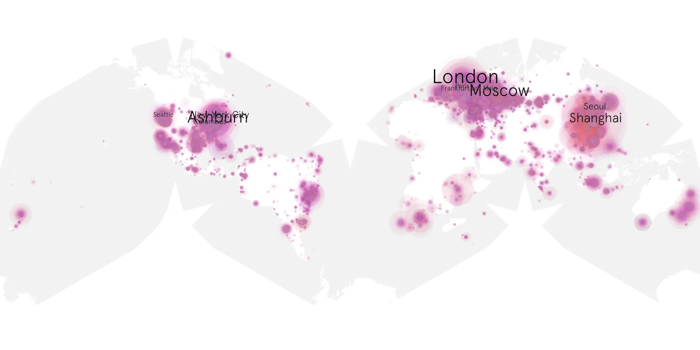
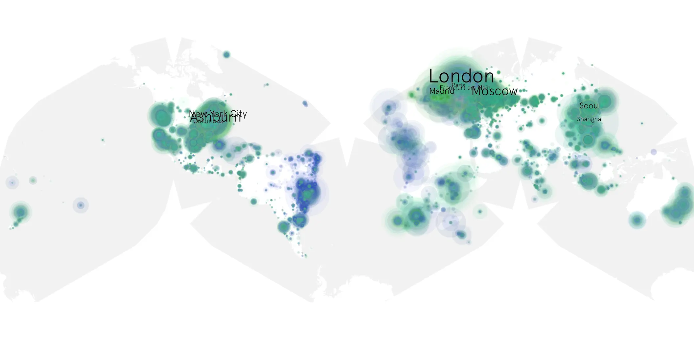

# y-the-last-man-101 sample cache audit

## 1. Media object

| Field | Value |
| --- | --- |
| Media object | Y: The Last Man |
| Collection key | `y-the-last-man-101` |
| imdb_id | [tt8042500](https://www.imdb.com/title/tt8042500/) |
| wikipedia_url | [Y: The Last Man (TV series)](https://en.wikipedia.org/wiki/Y:_The_Last_Man_(TV_series)) |
| Sample dates | 2021-09-13-to-2021-11-21 |
| Sample days | 70 |
| BTIH count | 162 |
| Unique BTIH count | 149 |
| Downloaders total | 4,522,178 |
| Uploaders total | 1,097,034 |
| Data version | `2026-08-05` |
| IP geolocation version | `6:1777968300` |

## 2. Coverage report

- Generated: 2026-09-03T11:11:21Z
- Evidence: read-only Day-member stream of the selected cache archive; no raw sample contents were opened
- Required sample span: 2021-09-13 to 2021-11-21 (70 days)
- Cache Day products: 70
- Sparse Day indices: 0
- Post-release Day products: 0

### Sample archive discontinuities

None detected.

## 3. File sizes histogram *median[lowest, highest]*

## 4. Graphs

### Downloads by week cumulative (normalized start)



### Downloads by day, Saturday and Sunday in gray

## 5. Cumulative Maps

<!-- https://raw.githubusercontent.com/alpha60-devops/alpha60-results-2021/refs/heads/main/data/ -->

### <a href="https://raw.githubusercontent.com/alpha60-devops/alpha60-results-2021/refs/heads/main/data/geojson.cumulative/y-the-last-man-101-cumulative-aggregate.geojson.gz" data-map-title="Y: The Last Man — y-the-last-man-101" onclick="leaflet_map_open_window(this.href, this.dataset.mapTitle); return false;" class="table-link" aria-label="Open Y: The Last Man (y-the-last-man-101) cumulative data map in new window" title="Opens interactive map for Y: The Last Man (y-the-last-man-101) data">Swarm Detail</a>

### Geographic Regions

| Africa | Americas | Asia | Europe | Oceania | Unknown |
| --- | --- | --- | --- | --- | --- |
| 5.37 | 27.61 | 18.06 | 39.45 | 2.31 | 4.32 |

### Network infrastructure

{:target="_blank" rel="noopener"}

### Resolution >= 1080p

{:target="_blank" rel="noopener"}

### Resolution < 1080p

{:target="_blank" rel="noopener"}
